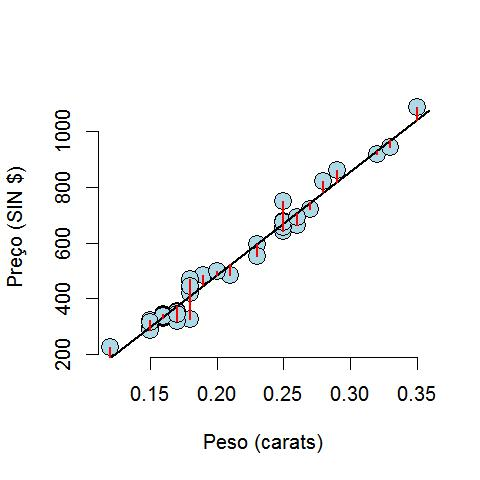

## O que é um modelo de regressão?

* Um modelo de regressão visa determinar a relação entre uma ou mais variáveis resposta (_y~1~_, _y~2~_, _y~3~_,..., _y~i~_) e preditoras (_x~1~_, _x~2~_, _x~3~_,..., _x~i~_).
* Um modelo de regressão pode ser visualizado na forma:  

<center>  
_$\bar{y}$_ = $\beta$~0~ + $\beta$~1~ _x_~1~ + $\beta$~2~ _x_~2~ + ... + $\beta$~i~ _x_~i~ + $\epsilon$   
</center>  

### O que são os coeficientes nestes modelos?

* Neste modelo, cada coeficiente $\beta$~i~ (i > 0) representa o efeito da variável preditora _x~i~_ sobre a variável resposta _$\bar{y}$_ - isto é, o quanto cada unidade de aumento/redução nos valores de _x~i~_ alteram os valores de _$\bar{y}$_: estes são os __slopes__ da regressão.
* O coeficiente $\beta$~0~ representa o __intercepto__ do modelo - isto é, o valor que a variável resposta _$\bar{y}$_ assume quando os valores de cada variável preditora _x~i~_ é igual a zero.
* O coeficiente $\epsilon$ representa o erro na estimativa do valor da variável resposta _$\bar{y}$_ de acordo com o modelo.
* No exemplo abaixo:

<center>  
_$\bar{Preço}$_ = $\beta$~0~ + $\beta$~Peso~ _x_~Peso~ + $\epsilon$  
</center>  

<center></img></center>    

### Mas o que representa cada um dos valores de $\beta$ em um modelo?

* Primeiro, vamos criar um vetor abaixo para analisarmos e entendermos melhor essa pergunta.  
  
```{r}
set.seed(33)
dados <- round(rnorm(n = 50, mean = 100, sd = 30), digits = 0)
dados # vetor de números aleatórios gerado de acordo com uma distribuição normal
```

* Agora, vamos criar um modelo de regressão linear simples, contendo apenas o seu intercepto utilizando a função `lm`.  

```{r}
summary(lm(dados ~ 1))
```

### No que se baseiam os valores de `Estimate`, `Std. Error` e `Residual standard error`?

* Lembre-se que os coeficientes de uma regressão são determinados a partir dos valores que minimizam a variação residual do modelo - a parte da variância nos dados que não é explicada pelo modelo.
* No gráfico que exploramos anteriormente, esta variação residual é representada pelas linhas vermelhas que conectam a reta da regressão à cada uma das observações.

<center></img></center>    

* Para dados que seguem a distribuição normal, quais são os valores esperados que melhor representam a medida de centralidade dos dados e variação ao redor deste centro?  
  
```{r}
mean(dados)
sd(dados)
```

* A __média__ representa o valor esperado mais provável para uma observação que venha de uma população _X_: `Estimate`;
* O __desvio padrão__ representa o valor esperado mais provável da diferença total existente entre as observações em uma população _X_ e o valor central que descreve esta população: `Residual standard error`.  
* A diferença média do quanto cada observação se afasta do valor esperado para a média de uma população é __erro padrão__: `Std. Error`.

* Com os valores do `Estimate` e do `Std. Error` podemos calcular o intervalo de confiança para a estimativa de cada parâmetro no modelo.
    + É um intervalo de valores que possui uma grande chance de conter o valor real de um parâmetro que descreve uma população.
    + Intervalo de confiança para a média:

<center>$\beta$~i~ $\pm$ 1.96 * SE</center>

```{r echo=FALSE, fig.align='center'}
hist(dados, xlab = "Valores observados", ylab = "Frequência", main = "", freq = FALSE)
mtext(text = expression(beta[0]), side = 3, adj = 0.60, col = "black", cex = 2)
mtext(text = "Intervalo de \n Confiança de 95%", side = 3, adj = 0.22, col = "blue", cex = 1.1)
rect(xleft = mean(dados) - (1.96 * (sd(dados)/sqrt(49))), ybottom = 0, xright = mean(dados) + (1.96 * (sd(dados)/sqrt(49))), 
     ytop = 0.0148, col = rgb(red = 0,green = 0,blue = 1, alpha = 0.4))
lines(x = c(mean(dados), mean(dados)), y = c(0, 150), lty = 1, lwd = 3)
```

* Podemos chegar no mesmo resultado obtido com a função `lm` quando usamos a função `glm` (falaremos mais sobre as GLMs mais a frente):

```{r}
summary(glm(dados ~ 1, family = gaussian))
```

## Meus dados seguem a família de distribuição de probabilidade normal?

* Podemos usar métodos gráficos ou testes estatísticos para descobrir se os dados se ajustam à distribuição normal.
* Métodos gráficos _vs_ métodos estatísticos:  
    + Os testes estatísticos são influenciados pelo tamanho da amostra;  
    + Os testes estatísticos são influenciados por outliers;  
    + Estes testes estatísticos são sensíveis à desvios na normalidade.  
    + __Minha recomendação__: use a visualização gráfica.  

```{r fig.align='center'}
# histograma de distribuição dos dados gerados
hist(x = dados, main = "Distribuição dos Dados", xlab = "Valores observados", ylab = "Frequência", freq = FALSE)

# QQ-Plot: plot da distribuição dos valores observados de acordo com uma expectativa teórica baseado nos quantis da distribuição
qqnorm(y = dados);qqline(y = dados)

# Teste de Shapiro-Wilk: testa a hipótese nula de que a população de dados segue a distribuição normal
shapiro.test(x = dados)
```

## E quando não sabemos o tipo de família de distribuição de probabilidade dos nossos dados?

* Na maior parte das vezes não temos a menor noção de que tipo de família de distribuição de probabilidade nossos dados seguem.
* Lembre-se que cada família de distribuição de probabilidade é descrita por um conjunto diferente de parâmetros.
* Estes parâmetros também descrevem os valores esperados mais prováveis para medidas de centralidade e variação ao redor do centro para cada uma destas distribuições estatísticas.
* O pacote `fitdistrplus` oferece alguns métodos para determinamos a distribuição mais adequada para um conjunto de dados cuja natureza da distribuição de probabilidade não é conhecida.    
* A função `fitdist` ajusta uma distribuição a um conjunto de dados e estima os parâmetros daquela distribuição.

```{r message=FALSE}
library(fitdistrplus)
ajuste1 <- fitdist(data = dados, distr = "norm")
coef(object = ajuste1) # compare com os valores esperados para a média, o desvio padrão e os resultados da função lm acima
```

> A função `fitdist` usa um estimador por verossimilhança máxima para determinar o valor mais provável para cada um dos parâmetros da distribuição de probabilidade - valor do parâmetro que minimiza a soma dos quadrados de um conjunto de dados.

* Podemos usar a função `fitdist` para ajustar outras famílias de distribuição de probabilidade.  

```{r message=FALSE}
coef(object = fitdist(data = dados, distr = "pois"))
coef(object = fitdist(data = dados, distr = "gamma"))
coef(object = fitdist(data = dados, distr = "weibull"))
coef(object = fitdist(data = dados, distr = "lnorm"))
```

* Este pacote possui outras três funções muito úteis para entender e determinar o tipo de família de distribuição de probabilidade que melhor se ajusta a um conjunto de dados:
    + `gofstat`: computa um teste para determinar o ajuste dos dados a uma ou mais famílias de distribuição de probabilidade;
    + `cdfcomp`: método gráfico que compara o ajuste dos dados a uma ou mais famílias de distribuição de probabilidade baseado na função de distribuição cumulativa da probabilidade (probabilidade acumulada de obter um valor _x_ maior ou igual a um dado valor _X_ determinado).
    + `descdist`: método gráfico que descreve os parâmetros gerais da distribuição de um conjunto de dados, bem como uma estimativa da kurtose e obliquidade dos dados (_skewness_) - conhecido como Gráfico de Cullen e Frey.

<center></img></center>     

* A função `gofstat` fornece uma medida quantitativa do quanto o uso de uma ou outra família de distribuição de probabilidade são capazes de descrever um conjunto de dados.  

```{r message=FALSE}
ajuste1 <- fitdist(data = dados, distr = "norm")
ajuste2 <- fitdist(data = dados, distr = "pois")
gofstat(f = list(ajuste1, ajuste2), fitnames = c("Normal", "Poisson"))
```

* A função `cdfcomp` é um método gráfico para determinarmos o quanto os valores de um conjunto de dados são bem ajustados por uma ou outra família de distribuição de probabilidade.

```{r fig.align='center'}
cdfcomp(ft = list(ajuste1, ajuste2), fitcol = c("blue", "red"), legendtext = c("Normal", "Poisson"))
```

* Uma outra função útil é a `descdist`, que oferece um método gráfico capaz de ajudar a determinar de qual tipo de distribuição um conjunto de dados melhor se aproxima.

```{r fig.align='center'}
descdist(data = dados, boot = 1000)
```

## Existe algum preço ao escolhermos usar uma ou outra família de distribuição de probabilidade nos modelos?

* Depende do seu objetivo: predição ou compreensão?
* Usar a família de distribuição de probabilidade errada pode aumentar a chance de um Erro do Tipo I: falso positivo.
    + _Overdispersion_: a estimativa do erro de um parâmetro é __subestimada__ - a distribuição estatística prevê que a dispersão do conjunto de dados é menor do que real.  
    + Outra forma de ver isso: os dados estão mais dispersos do que o esperado pela família de distribuição de probabilidade.  
    + Ocorre principalmente quando tentamos utilizar a distribuição `poisson` ou `binomial` - ambas assumem que a variância é igual à média.  

```{r}
set.seed(33)
dados <- round(rnorm(n = 100, mean = 1500, sd = 600))
dt1 <- fitdist(dados, "norm")
dt2 <- fitdist(dados, "pois")
(dt1 <- bootdist(dt1)$CI[1,])
(dt2 <- bootdist(dt2)$CI)
```

```{r echo=FALSE, fig.align='center'}
par(mfrow = c(1,2))
hist(x = dados, main = "Distribuição Normal", ylab = "Frequência", xlab = "Valores observados", freq = FALSE)
lines(x = c(dt1[1], dt1[1]), y = c(0, 30), lty = 1, col = "blue", lwd = 3)
lines(x = c(dt1[2], dt1[2]), y = c(0, 30), lty = 2, col = "blue", lwd = 3)
lines(x = c(dt1[3], dt1[3]), y = c(0, 30), lty = 2, col = "blue", lwd = 3)
hist(x = dados, main = "Distribuição de Poisson", ylab = "Frequência", xlab = "Valores observados", freq = FALSE)
lines(x = c(dt2[1], dt2[1]), y = c(0, 30), lty = 1, col = "red", lwd = 3)
lines(x = c(dt2[2], dt2[2]), y = c(0, 30), lty = 2, col = "red", lwd = 3)
lines(x = c(dt2[3], dt2[3]), y = c(0, 30), lty = 2, col = "red", lwd = 3)
```

## Pensamento final: o que fazer quando os dados não são normais?

* Transformações para normalizar os dados podem ser úteis e, até mesmo, um método preferível quando o seu objetivo é a predição.
* As GLMs podem ser usadas para criar modelos utilizando outras famílias de distribuição de probabilidade.
* O forte desta classe de modelos é que ele pode ser usado quando os __resíduos__ de uma modelo linear não são normais.  
    + General Linear Models: distribuição dos resíduos do modelo segue a distribuição normal (`lm`, `glm::gaussian`).    
    + General__ized__ Linear Models: distribuição dos resíduos do modelo não segue a distribuição normal (`glm`).  