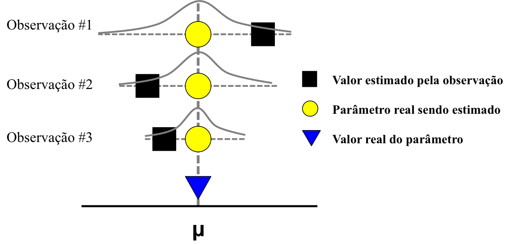
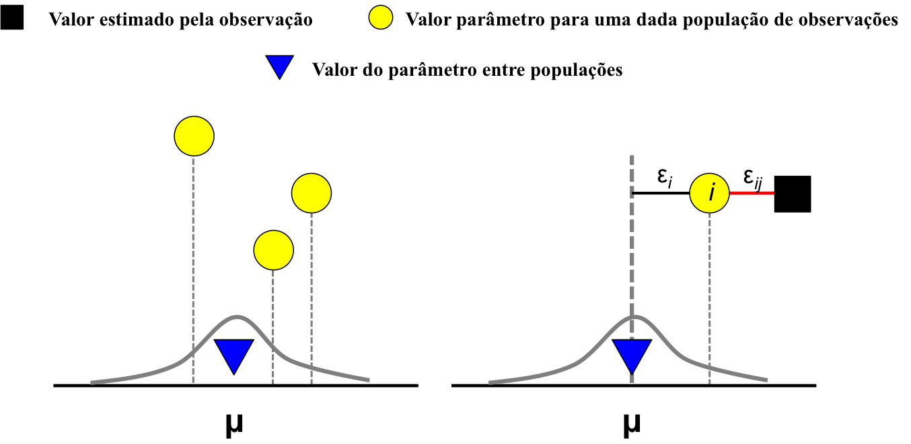

## Modelos Fixos

* Um modelo normalmente contém __termos fixos__: variáveis preditoras cujas quantidades não são uma amostra aleatória da 'realidade'.
* Normalmente, estas variáveis representam tratamentos experimentais/observacionais dos quais estamos interessados em quantificar e entender a magnitude de um efeito.
* Em um modelo com variáveis fixas, nós assumimos que:
    + Todas as observações pertencem a uma mesma população e estão medindo a mesma coisa.  
    + A variabilidade existente é explicada unicamente por erro na amostragem de cada observação.
    

</img>

* Exemplo de modelo fixo:  

  
_$\bar{y}$_ = $\beta$~0~ + $\beta$~1~ _x_~1~ + $\beta$~2~ _x_~2~ + ... + $\beta$~i~ _x_~i~ + $\epsilon$   

  

## Modelos aleatórios

* Por outro, alguns modelos podem conter apenas __termos aleatórios__: variáveis preditoras cujas quantidades são uma amostra aleatória da 'realidade'. 
* Normalmente, estas variáveis representam características do nosso desenho experimental/estudo que podem influenciar o comportamento da variável resposta, mas cuja influência não é o foco do nosso interesse.  
    + Importante incorporar esta fonte 'extra' de variabilidade para compreendermos os resultados;  
    + "Remove" o ruído no resultado.  
* Desta forma, em um modelo aleatório:
    + Cada observação ou conjunto de observações pertencem a diferentes subpopulações que compõem uma população maior: cada observação está estimando o verdadeiro efeito existente sua subpopulação.  
    + A variabilidade existente é explicada pelo erro na amostragem de cada observação e por diferenças entre subpopulações de observações  
* Em um modelo aleatório, temos dois componentes que contribuem para a estimativa do erro residual:
    + Diferenças entre observações dentro das subpopulações: $\epsilon$~i,j~ (__within-subject__)
    + Diferenças entre subpopulações: $\epsilon$~i~ (__between-subject__)
* Você é capaz de explorar onde existe maior variância nos resultados: dentro de subpopulações de observações ou entre observações - em outras palavras: _consistência_ ou _contingência_.  

</img>

* Um exemplo de modelo aleatório:

  
_$\bar{y}$_ = $\beta$~0~ + $\epsilon$~i,j~ + $\epsilon$~i~  

  

* Note que o erro do modelo agora é composto por duas frações: estimativa do erro residual total no modelo é maior.  
* __Consequência__: intervalos de confiança para os parâmetros de um modelo são maiores.  
* Uma possível 'vantagem' de incluir uma variável como um termo aleatório em um modelo: economia de graus de liberdade.  

## Mixed-effects models

* Reúne as características dos modelos fixos e dos modelos aleatórios: composto de termos fixos e termos aleatórios.

  
_$\bar{y}$_ = $\beta$~0~ + $\beta$~1~ _x_~1~ + $\beta$~2~ _x_~2~ + ... + $\beta$~i~ _x_~i~ + $\epsilon$~i,j~ + $\epsilon$~i~  

  

## No R

* Modelos fixos apenas são implementados pelas funções `lm` e `glm`, por exemplo;
* Modelos aleatórios e mistos são implementados em funções dos pacotes `nlme` e `lme4`, por exemplo.
