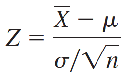
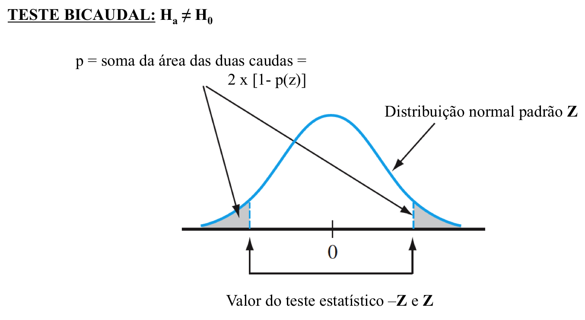
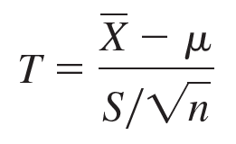
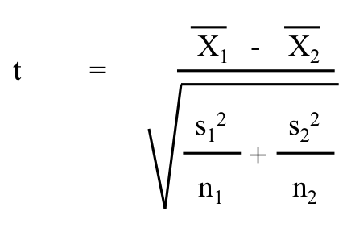
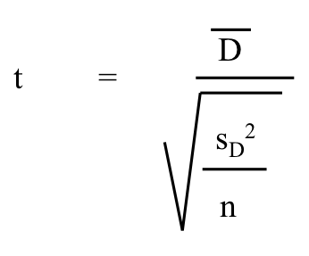
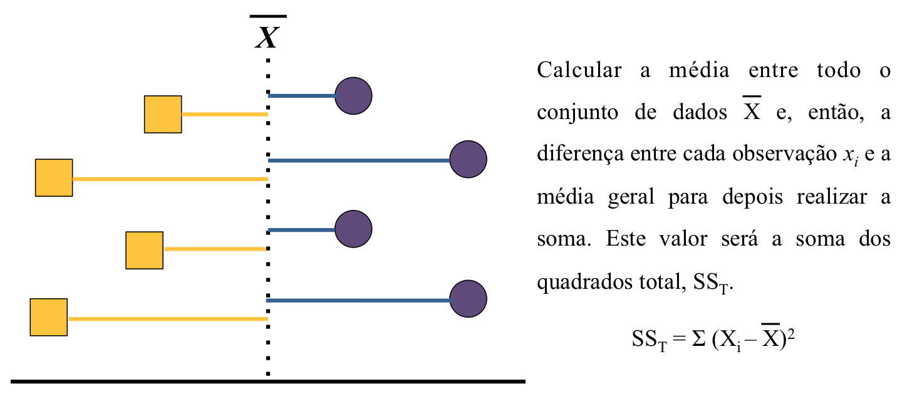
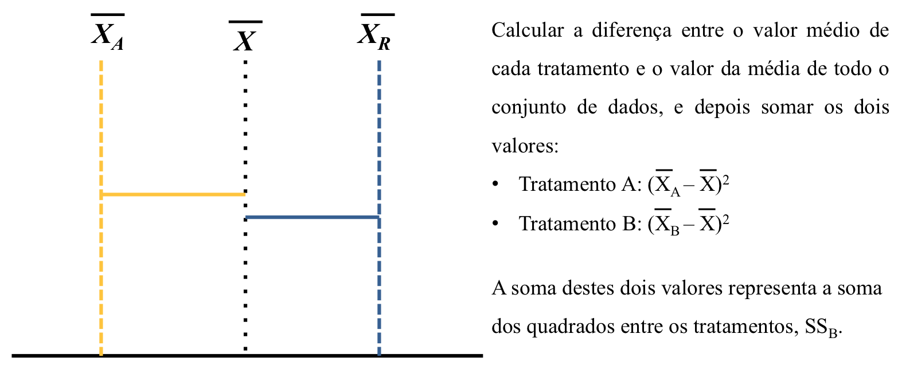
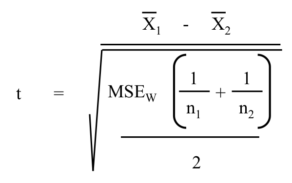

```{r echo=FALSE}
suppressWarnings(suppressPackageStartupMessages(suppressMessages(library(tidyverse))))
suppressWarnings(suppressPackageStartupMessages(suppressMessages(library(lsmeans))))
suppressWarnings(suppressPackageStartupMessages(suppressMessages(library(visreg))))
suppressWarnings(suppressPackageStartupMessages(suppressMessages(library(car))))
```

## Imagine... {.smaller}

Em uma dada localidade, existem, em média, 17.76 espécies de larvas de insetos aquáticos por poça, com um erro padrão de 3.1. Entretanto, ao amostrar uma poça nesta mesma região, você encontrou apenas 12 espécies destes organismos. Isto fornece evidência para afirmar de que o valor que você encontrou é menor do que aquele esperado?

```{r echo = FALSE, fig.align = 'center', fig.width = 4.5, fig.height = 4.5}
set.seed(32432)
hist(x = rnorm(n = 100, mean = 17.76, sd = 3.1), xlab = "Riqueza de Espécies", ylab = "Frequência", main = "")
mtext(text = expression(paste(bar(x), " = 17.76; SD = 3.1")), side = 3, adj = 0.7)
mtext(text = expression(paste(mu, " = 12")), side = 3, adj = 0.12)
lines(x = c(17.76, 17.76), y = c(0, 39), lty = 1, lwd = 3, col = "red2")
lines(x = c(12, 12), y = c(0, 39), lty = 2, lwd = 3, col = "blue2")
```

## Conteúdo da Aula

1. Testes de hipóteses com uma amostra
    + Distribuição normal padrão
    + Distribuição t de Student
2. Testes de hipóteses com duas amostras
    + Teste-t de Student
3. Testes de hipóteses com mais de duas amostras
    + ANOVA
    + Pós-testes

## Testes de hipóteses com uma amostra

* Um parâmetro pode ser estimado a partir de uma amostra e sumarisado na forma de um valor ou um intervalo de valores possíveis. Entretanto, ás vezes, o objetivo de um estudo pode não ser em estimar tal parâmetro, mas decidir qual afirmação sobre um dado parâmetro é o correto.  
    + H~a~: A riqueza de espécies nas poças no seu estudo é __menor__ do que o valor esperado; ou,  
    + H~0~: A riqueza de espécies nas poças no seu estudo é __maior ou igual__ ao valor esperado
* Podemos decidir qual das duas afirmações é maios sustentada por um conjunto de dados através de um valor de __teste estatístico__ (_test statistic_).  
    + Valor baseado em uma distribuição de probabilidade com propriedades conhecidas, e que será usado para discriminar entre as duas _hipóteses_, nos ajudando a decidir se a hipótese nula (H~0~) deve ser rejeitada ou não.

## A distribuição normal padrão {.smaller}

* É uma caso especial da distribuição normal, onde o valor da média (_$\bar{x}$_) de uma amostra é igual a 0 e o seu desvio padrão (_$\sigma$_) é igual a 1.

```{r eval=FALSE}
set.seed(123)
hist(x = rnorm(n = 100, mean = 0, sd = 1))
```

```{r echo=FALSE, fig.align='center', fig.height=4, fig.width=4.5}
set.seed(123)
hist(x = rnorm(n = 100, mean = 0, sd = 1), main = "Distribuição normal padrão", ylab = "Frequência", xlab = "Valores observados")
```

## A distribuição normal padrão {.smaller}

* De acordo com a distribuição normal padrão _Z_, quanto maior a diferença padronizada entre um dado valor e a média, menor a probabilidade daquele valor ser observado naquela amostra.

```{r echo = FALSE, fig.align='center', fig.height=5, fig.width=6}
set.seed(123)
hist(x = rnorm(n = 100, mean = 0, sd = 1), main = expression(paste("Distribuição normal padrão ", bolditalic(Z))), freq = FALSE, ylab = "Probabilidade", xlab = "Valores observados")
mtext(text = expression(paste("1.64", sigma, " = 90%")), side = 3, adj = 0.1, col = "blue")
mtext(text = expression(paste("1.96", sigma, " = 95%")), side = 3, adj = 0.5, col = "orange3")
mtext(text = expression(paste("2.58", sigma, " = 99%")), side = 3, adj = 0.9, col = "red2")
lines(x = c(1.64, 1.64), y = c(0, 0.45), lty = 1, lwd = 3, col = "blue");lines(x = c(-1.64, -1.64), y = c(0, 0.45), lty = 1, lwd = 3, col = "blue")
lines(x = c(1.96, 1.96), y = c(0, 0.43), lty = 1, lwd = 3, col = "orange3");lines(x = c(-1.96, -1.96), y = c(0, 0.43), lty = 1, lwd = 3, col = "orange3")
lines(x = c(2.58, 2.58), y = c(0, 0.4), lty = 1, lwd = 3, col = "red2");lines(x = c(-2.58, -2.58), y = c(0, 0.4), lty = 1, lwd = 3, col = "red2")
```

## A distribuição normal padrão

* Podemos usar o valor de _Z_ como um teste estatístico para testar a H~0~ de que a riqueza de espécies observada é maior ou igual àquela esperada.
* O valor do teste estatístico, _Z_, é:

<center></img></center>    
  
* De acordo com o exemplo do início da aula:
    + Número de espécies médio nas poças: _$\bar{X}$_ = 17.76;  
    + Erro padrão da amostra: _$\sigma$_/$\sqrt{n}$ = 3.1
    + Valor observado: _$\mu$_ = 12
    + Z = (17.76 - 12)/(3.1) = 1.858065
    
## No exemplo do início da aula

* A nossa estimativa está distante cerca de 1.85 unidades de erro padrão do valor reportado anteriormente.

```{r echo = FALSE, fig.align = 'center', fig.width = 5.5, fig.height = 5}
set.seed(123)
hist(x = rnorm(n = 100, mean = 0, sd = 1), main = "", freq = FALSE, ylab = "Probabilidade", xlab = "Valores observados")
mtext(text = expression(paste("Diferença entre ", bar(X), " e ", mu, ": Z = 1.857065", sigma)), side = 3, adj = 0.5, padj = -0.5)
lines(x = c(0, 0), y = c(0, 0.45), lty = 1, lwd = 3, col = "red2")
lines(x = c(1.857065, 1.857065), y = c(0, 0.45), lty = 2, lwd = 3, col = "blue2")
arrows(x0 = 0.1, x1 = 1.75, y0 = 0.46, y1 = 0.46, length = 0.15, code = 3, lwd = 2)
```

---

* Com o valor calculado do teste estatístico, _Z_, podemos testar a hipótese nula H~0~ de que a riqueza de espécies observada é maior ou igual ao valor esperado.
* Testamos esta hipótese calculando a __probabilidade _p_ de obtermos um valor de Z tão extremo quanto aquele observado assumindo que a hipótese nula é verdadeira__. 
* Para tanto, devemos determinar qual o tipo de teste de hipótese devemos testar
    + Unicaudal: H~a~ > H~0~ __OU__ H~a~ < H~0~
    + Bicaudal: H~a~ $\neq$ H~0~

## Testes unicaudais

<center></img></center>    

## Testes bicaudais

<center></img></center>    

## No nosso exemplo... {.smaller}

* Nossa hipótese alternativa H~a~ é que a riqueza de espécies observada (_$\mu$_ = 12) é menor do que a riqueza de espécies esperado (_$\bar{x}$_ = 17.76): H~a~ < H~0~.
* Apesar do nosso valor calculado de Z ser positivo (Z = 1.857065), nosso teste de hipótese 'pede' que ele seja negativo. Como as caudas da distribuição normal padrão são simétricas, podemos multiplicar o valor de Z por -1 para testar a hipótese nula e buscar o valor de p do teste estatístico.

```{r echo=FALSE, fig.align = 'center', fig.width = 5.5, fig.height = 4}
cord.x <- c(-3, seq(from = -3, to = -1.96, by = 0.01), -1.96) 
cord.y <- c(0, dnorm(seq(from = -3, to = -1.96, by = 0.01)), 0) 
curve(dnorm(x, mean = 0, sd = 1), xlim = c(-3, 3), bty = "l", xlab = "Valores observados", y = "Probabilidade") 
polygon(cord.x, cord.y, col = 'grey70')
lines(x = c(0, 0), y = c(0, 0.397), lty = 1, lwd = 3, col = "red2")
lines(x = c(1.857065, 1.857065), y = c(0, 0.397), lty = 2, lwd = 3, col = "blue2")
lines(x = c(-1.857065, -1.857065), y = c(0, 0.397), lty = 2, lwd = 3, col = "blue2")
mtext(text = "Z = -1.857065", side = 3, adj = 0.1, padj = 0.5)
mtext(text = "Z = 1.857065", side = 3, adj = 0.9, padj = 0.5)
```

---

* Podemos procurar o valor de p na tabela de distribuição de tais valores para a distribuição normal padrão.  

<center></img></center>    

---

* Ou podemos usar alguma outra ferramenta que calcule este valor para nós.   
* No R, a função `prnorm` pode ser usada para isso.

```{r}
pnorm(q = -1.857065)
```

* Ou, de forma direta...

```{r}
pnorm(q = 12, mean = 17.76, sd = 3.1)
```

## Exercício 1

1. Compare o resultado das duas linhas de comando abaixo. Qual a diferença entre elas e por que isso ocorre?

```{r eval=FALSE}
pnorm(q = 1.857065)
pnorm(q = 1.857065, lower.tail = FALSE)
```

## A distribuição t de Student

* Muito usada para testar _diferenças_, especialmente quando:
    + As observações de uma amostra seguem uma distribuição normal;
    + O tamanho da amostra é pequeno (normalmente < 40 observações); e,
    + O desvio padrão da população é desconhecido (não confundir com o desvio padrão da amostra!).
* Ao contrário da distribuição (padrão) normal, é descrita por apenas um parâmetro: os __graus de liberdade__.
* No R, você pode criar um conjunto de observações que sigam esta distribuição usando: `rt(n, df)`.
* Distribuição de densidade é muito similar àquela da distribuição normal, mas curva é mais 'magra'.

## Distribuição normal padrão _vs_ t de Student

```{r echo=FALSE, fig.align = 'center', fig.width = 8, fig.height = 4}
par(mfrow = c(1,2))
curve(dnorm(x, mean = 0, sd = 1), xlim = c(-3, 3), bty = "l", main = "Distribuição Normal Padrão Z", xlab = "Valores observados", y = "Probabilidade") 
curve(dt(x, df = 1), xlim = c(-3, 3), bty = "l", main = "Distribuição t de Student",  xlab = "Valores observados", y = "Probabilidade")  
par(mfrow = c(1,1))
```

## A distribuição t de Student {.smaller}

* Quanto maior o número de graus de liberdade, mais próximo a distribuição t de Student se aproximada da distribuição (normal) padrão.

```{r echo=FALSE, fig.align = 'center', fig.width = 8, fig.height = 5}
curve(dnorm(x, mean = 0, sd = 1), xlim = c(-3, 3), bty = "l", main = "", xlab = "Valores observados", y = "Probabilidade", lwd = 2) 
curve(dt(x, df = 1), xlim = c(-3, 3), add = TRUE, col = "blue", lwd = 2, lty = 2)  
curve(dt(x, df = 2), xlim = c(-3, 3), add = TRUE, col = "green2", lwd = 2, lty = 2)  
curve(dt(x, df = 5), xlim = c(-3, 3), add = TRUE, col = "gold2", lwd = 2, lty = 2)  
curve(dt(x, df = 30), xlim = c(-3, 3), add = TRUE, col = "orange3", lwd = 2, lty = 2)  
curve(dt(x, df = 100), xlim = c(-3, 3), add = TRUE, col = "red3", lwd = 2, lty = 2)  
```

## Teste de hipóteses com uma amostra usando a distribuição t de Student

* O teste estatístico que segue a distribuição t de Student, __T__ é calculado de forma muito similar ao valor de __Z__:

<center></img></center>

* Aqui, o desvio padrão da população, _$\sigma$_, é substituído pelo desvio padrão da amostral, S.
* Além disso, a obtenção da probabilidade de observarmos um valor do teste estatístico __T__ mais extremo do que aquele esperado caso a hipótese nula seja verdadeira é dependente dos graus de liberdade, calculados com __n - 1__.

## Teste de hipóteses com uma amostra usando a distribuição t de Student

<center></img></center>

## Exercício 2

Ao amostrar 10 fragmentos florestais de tamanho similar, você obtém as seguintes estimativas de densidade para uma espécie de árvore:

```{r}
abundancia <- c(11, 16, 43, 21, 21, 45, 26, 1, 9, 13)
```

Em uma paisagem não-fragmentada, esta mesma espécie apresenta uma densidade aproximada de 10 indivíduos para uma área similar àquela dos fragmentos. Neste sentido, poderíamos afirmar que a densidade registrada nos fragmentados é maior do que nesta área contínua?  

* H~a~: densidade nos fragmentos é > 10;  
* H~0~: densidade nos fragmentos é ≤ 10;  
* Calcule o valor de t e se a função `pt` para calcular o valor de p.

## Exercício 2 {.smaller}

A solução do exercício é:

```{r}
## calculando o valor de t
valor_t <- (mean(abundancia) - 10)/(sd(abundancia)/sqrt(10))
valor_t

## calculando o valor de p
### como queremos determinar se o valor de acordo com Ha é > do que de 
### acordo com H0, lower.tail = FALSE
pt(q = valor_t, df = 9, lower.tail = FALSE)
```

## Testes de hipóteses com duas amostras

Como determinar se dois conjuntos de amostras tomadas de uma população diferem?

```{r echo=FALSE, fig.align='center', fig.width=5, fig.height=4.5}
set.seed(123);v1 <- rnorm(n = 100, mean = 15, sd = 3)
set.seed(123);v2 <- rnorm(n = 100, mean = 5, sd = 3)
ggplot() +
  geom_density(data = data.frame(v1), mapping = aes(x = v1, ..count..), colour = "black", fill = "gold2", alpha = 0.5) +
  geom_density(data = data.frame(v2), mapping = aes(x = v2, ..count..), colour = "black", fill = "purple2", alpha = 0.5) +
  scale_y_continuous(name = "Número de observações", expand = c(0, 0), limits = c(0, 15)) +
  scale_x_continuous(name = "Valores", expand = c(0, 0)) +
  theme_bw() + 
  theme(panel.grid = element_blank(),
        axis.text = element_blank(),
        axis.ticks = element_blank()) 
```

## O teste-t de Student

* É uma análise estatística paramétrica muito utilizada para determinar se duas amostras são diferentes;  
    + Análise paramétrica: parâmetros estimados a partir dos dados pertencem à uma família de distribuição de probabilidade.  
* Testa a hipótese nula de que os valores médios das observações vindas de duas amostras não diferem entre si; ou seja:
    + H~0~: $\bar{x}$~1~ - $\bar{x}$~2~ = 0 __OU__ $\bar{x}$~1~ = $\bar{x}$~2~
* Pressupostos:
    + Amostras seguem uma distribuição normal;  
    + Amostras balanceadas;  
    + Variâncias não diferem entre as amostras;  
    + Observações em cada amostra e entre amostras são independentes entre si.  

## O teste-t de Student

* Quando todos os pressupostos do teste-t de Student são atendidos, podemos calcular o valor do teste estatístico, __t__, como a diferença entre as médias das duas amostras, padronizada pela medida agrupada do erro na estimativa das duas médias.

<center></img></center>

* O numerador representa a magnitude da diferença entre as duas médias: quanto maior esta diferença, maior o valor de t;
* O denominador representa a magnitude da variabilidade existente nas duas amostras: quanto maior a variabilidade, menor o valor de t.  

## O teste-t de Student

* Uma vez que tenhamos calculado o valor do teste estatístico t, podemos determinar a probabilidade p de obter um valor tão extremo quanto aquele observado para o teste estatístico caso a hipótese nula seja verdadeira - de maneira similar ao que fizemos para o teste t para uma amostra.
* Aqui, no entanto, o número de graus de liberdade utilizados para o teste de hipótese é __n~1~ - 1 + n~2~ - 1__.

## Exemplo

A riqueza de espécies difere entre ilhas costeiras e ilhas oceânicas?

```{r message=FALSE}
## carregando o conjunto de dados que vamos trabalhar
ilhas <- read_tsv(file = "data/ilhas.txt")

# qual o numero de observacoes em cada uma das duas categorias de tipos de ilhas?
table(ilhas$ilha)
```

## Exemplo {.smaller}

* Calcular a riqueza de espécies média entre os dois tipos de ilha;  

```{r}
media <- as.vector(by(data = ilhas$riqueza, INDICES = ilhas$ilha, mean))
by(data = ilhas$riqueza, INDICES = ilhas$ilha, mean)
```

* Calcular o desvio padrão da riqueza de espécies entre os dois tipos de ilha.  

```{r}
desvio <- as.vector(by(data = ilhas$riqueza, INDICES = ilhas$ilha, sd))
by(data = ilhas$riqueza, INDICES = ilhas$ilha, sd)
```

## Exemplo {.smaller}

* Calculando o valor de t

```{r}
## diferenca entre medias
diff_medias <- (media[1] - media[2])

## variabilidade total
var_total <- sqrt(((desvio[1]^2)/40) + ((desvio[2]^2)/40))

## valor de t
valor_t <- diff_medias/var_total
valor_t
```

* Testando a nossa hipótese: $\bar{x}$~costeira~ $\neq$ $\bar{x}$~oceanica~.

```{r}
## como não determinamos se a diferença é positiva ou negativa, usaremos um teste bicaudal
2 * (1 - pt(q = valor_t, df = ((40 - 1) + (40 - 1))))
```

## Simplificando o teste-t

* No R, basta usar:

```{r}
t.test(riqueza ~ ilha, data = ilhas, var.equal = TRUE, alternative = "two.sided")
```
  
## Exercício 3
  
E se quissésemos testar se as ilhas costeiras têm uma riqueza de espécies maior do que as ilhas oceânicas, como deveríamos fazer a análise?

## Teste-t pareado

* Ás vezes, nossa pergunta principal pode envolver comparações entre observações que __não__ são independentes - nestes casos, podemos usar um __teste-t pareado__:
    + Design Before-After-Control-Impact (BACI);
    + Medidas nos mesmos indivíduos/populações em dois momentos diferentes;
    
```{r message=FALSE, echo=FALSE, warning=FALSE, fig.align='center', fig.width=3, fig.height=3}
read_tsv(file = "data/riachos.txt") %>% 
  gather(key = "local", value = "valor", montante, jusante) %>%
  ggplot(mapping = aes(x = local, y = valor, group = riacho, fill = riacho)) +
  geom_line() +
  geom_point(shape = 21, colour = "black", size = 3) +
  scale_fill_manual(values = rainbow(n = 10)) +
  scale_y_continuous(name = "Medida") +
  scale_x_discrete(name = "Amostra", labels = c("1", "2")) +
  theme_bw() + 
  theme(panel.grid = element_blank(),
        axis.ticks = element_blank(),
        axis.text.y = element_blank(),
        legend.position = "none") 
```

## Teste-t pareado {.smaller}

* Testa a hipótese nula de que não há diferença entre cada par de observações é zero: $\bar{D}$ = 0.

```{r message=FALSE}
riachos <- read_tsv(file = "data/riachos.txt")
riachos$diferenca <- riachos$montante - riachos$jusante
riachos
```

## Teste-t pareado 

* De forma análoga ao teste-t padrão, o valor do teste estatístico __t__ é obtido através da razão entre a magnitude média da diferença entre os pares de observações e a sua variabilidade.

<center></img></center>

* O número de graus de liberdade utilizados para o teste de hipóteses é __n - 1__, onde _n_ é o número de pares independentes.
* No R, podemos fazer um teste-t pareado utilizando o argumento `paired = TRUE` dentro da função `t.text`.

## Exemplo de teste-t pareado {.smaller}

* Pomos fazer um teste-t pareado no R utilizando:

```{r}
t.test(x = riachos$montante, y = riachos$jusante, paired = TRUE, var.equal = TRUE)
```

* Note a diferença para: `t.test(x = riachos$montante, y = riachos$jusante, paired = FALSE, var.equal = TRUE)`.

## Teste-t quando as variâncias não são homogêneas

* Também é possível utilizar um teste-t quando as variâncias entre as duas amostras não são homogêneas;
* O teste-t com variâncias não homogêneas também é conhecido como teste de Welch;  
* Neste caso, todos os pressupostos do teste-t padrão continuam sendo válidas, mas os graus de liberdade utilizados para o teste de hipóteses são ajustados:

<center></img></center>

## Teste de Welch no R

* O teste de Welch bicaudal é o padrão assumido pelo R quando você não específica nenhum outro argumento na função `t.test`.

```{r}
t.test(riqueza ~ ilha, data = ilhas)
```

## Testes de hipóteses com mais de duas amostras

E quando temos mais de duas amostras? Podemos fazer múltiplos testes-t?

```{r echo=FALSE, fig.align='center', fig.width=5, fig.height=4.5}
set.seed(123);v1 <- rnorm(n = 100, mean = 10, sd = 3)
set.seed(123);v2 <- rnorm(n = 100, mean = 5, sd = 3)
set.seed(123);v3 <- rnorm(n = 100, mean = 20, sd = 3)
ggplot() +
  geom_density(data = data.frame(v1), mapping = aes(x = v1, ..count..), colour = "black", fill = "gold2", alpha = 0.5) +
  geom_density(data = data.frame(v2), mapping = aes(x = v2, ..count..), colour = "black", fill = "purple2", alpha = 0.5) +
  geom_density(data = data.frame(v3), mapping = aes(x = v3, ..count..), colour = "black", fill = "firebrick2", alpha = 0.5) +
  scale_y_continuous(name = "Número de observações", expand = c(0, 0), limits = c(0, 15)) +
  scale_x_continuous(name = "Amostras/Tratamentos", expand = c(0, 0)) +
  theme_bw() + 
  theme(panel.grid = element_blank(),
        axis.text = element_blank(),
        axis.ticks = element_blank()) 
```

## Análise de Variância (ANOVA)

* É uma análise estatística utilizada para testar diferenças entre os valores das médias de duas ou mais amostras/tratamentos de uma única vez;
* Testa a hipótese nula de que não existem diferenças nos valores das médias entre as amostras/tratamentos:

<center>
H~0~: $\mu$~1~ - $\mu$~2~ - $\mu$~3~ - ... - $\mu$~n~ = 0
</center>

<center>
__OU__
</center>

<center>
H~0~: $\mu$~1~ = $\mu$~2~ = $\mu$~3~ = ... = $\mu$~n~
</center>

* Não te diz qual média difere de qual, apenas que pelo menos uma das médias é diferente das demais - descobrir qual delas é uma tarefa para os pós-testes.

## Principais pressupostos da ANOVA

1. __Resíduos__ seguem uma distribuição normal;  
    + Transformação da variável resposta: log, sqrt, asin(sqrt), raiz cúbica, raiz quarta, inverso, logit...
        + Algumas pessoas suportam que pode ser feita;
        + Outras pessoas suportam que não deve ser feita;
        + Para mim, depende da sua pergunta e objetivo.  
2. Variâncias entre amostras/tratamentos são homogêneas (__homocedasticidade das variâncias__);  
3. Valores das amostras/tratamentos são fixos, normalmente categorias;  
4. Observações são independentes, espacialmente e temporalmente.  

## A mecânica da ANOVA {.smaller}

* Mas se é uma análise de __variância__, porque testa uma hipótese nula sobre as __médias__?
* A ANOVA calcula:
    + A diferença total entre cada observação e a média total do conjunto de dados composto por várias amostras/tratamentos (__total__): _x~i~ - $\bar{x}$_
    + A diferença total entre cada observação pertencente à uma amostra/tratamento e o valor da média daquele tratamento (__within-subject__): _x~i~ - $\bar{x}$~i~_; e,
    + A diferença total entre o valor da média de cada tratamento e o valor da média de todo o conjunto de dados (__between-subject__): _$\bar{x}$~i~ - $\bar{x}$_.
* O problema das diferenças: seu somatório tende a ser zero ou muito próximo dele, pois os desvios positivos 'anulam' os desvios positivos;
* A solução é elevar cada uma destas diferenças quadrado - ou seja, utilizar as variâncias como medida de diferenças entre médias: 
    + Total: $\sum\limits \left(x_{i} - \bar{x}\right)^{2}$
    + Within-subject: $\sum\limits \left(x_{i} - \bar{x_i}\right)^{2}$
    + Between-subject: $\sum\limits \left(\bar{x_i} - \bar{x}\right)^{2}$

## A mecânica da ANOVA

<center></img></center>

## A mecânica da ANOVA

<center></img></center>

## A mecânica da ANOVA

<center></img></center>

## A mecânica da ANOVA

* Ao final do processo, acabamos com três tipos de soma dos quadrados, que se relacionam na forma:

<center>SS~T~ = SS~B~ + SS~W~</center>

* Em outras palavras, a variabilidade total em um conjunto de dados (SS~T~) é particionada entre o que pode ser explicado pela diferença existente entre amostras/tratamentos (SS~B~) e pela variação natural existente dentro de cada tratamento ou a variação _residual_ (SS~W~).  
* Uma vez que se consiga quantificar duas destas quantidades, a terceira pode ser determinada por subtração ou soma.

## A mecânica da ANOVA

* Precisamos também considerar o efeito no número de amostras/tratamentos e observações no cálculo da Soma dos Quadrados: 
    + Quanto maior o número de amostras/tratamentos, maior tende a ser o SS~B~;
    + Quanto maior o npumero de observações, maior tende a ser o SS~W~.
* Por conta disso, cada um destes termos deve ser ponderado pelo seu número de graus de liberdade:
    + SS~B~: __n - 1__, onde n aqui é o número de amostras/tratamentos;
    + SS~W~: __k - n__, onde k aqui é o número total de observações;
    + SS~T~: __k - 1__
* A divisão de cada uma destas somas dos quadrados pelos seus respectivos graus de liberdade dá origem à uma medida conhecida com os Quadrados Médios (MSE~B~, MSE~W~ e MSE~T~, respectivamente).  
* Mas qual o tipo de valor de teste estatístico utilizado pela ANOVA?  

## A distribuição de probabilidade F

* É uma família de distribuição de probabilidade utilizada para descrever razões entre medidas de variância ou fontes de variabilidade em um conjunto de dados.
* O valor do teste estatístico F é obtido como: F = $\frac{num~~df}{den~~ddf}$
* Os dois parâmetros utilizados para calcular este teste estatístico são: 
    + __num df__: número de graus de liberdade no numerador 
    + __den df__: número de graus de liberdade no denominador
* Uma variável que assuma uma distribuição F não pode apresentar valores negativos; portanto, valores que seguem a distribuição F são sem 0 > _x_ > +$\infty$.

## Exercício 4

* Utilize o código abaixo para entender de que forma funciona distribuição de probabilidade de F.  

```{r eval=FALSE}
## criando uma função para plotar diferentes valores de num df e den df
distF <- function(numdf, dendf) {
  curve(df(x, df1 = numdf, df2 = dendf), xlim = c(0, 10), 
        xlab = "Valor de F", ylab = "Probabilidade")
}

## criando um modo de realizarmos manipulações automatizadas em cima do gráfico 
## gerado pela função distF
library(manipulate)
manipulate(distF(numdf, dendf), 
           numdf = slider(2, 100, step = 1),
           dendf = slider(2, 100, step = 1))
```

## A distribuição F como teste estatístico para a ANOVA

* Em analogia à distribuição, calculamos um valor de teste estatístico F para cada termo um uma ANOVA que represente a variabilidade em função a diferenças entre amostras/tratamentos;  
* Este valor do teste estatístico é calculado como: F = $\frac{MSE_B}{MSE_W}$;  
* Quanto maior a diferença média entre amostras/tratamentos (MSE~B~) em relação àquela diferença média que não pode ser explicada por ela (MSE~W~), maior será o valor de F;  
* Como vimos no exercício, quanto maior o valor de F, maior a probabilidade de rejeitarmos a hipótese nula de que não existem diferneças nos valores das médias entre as amostras/tratamentos.  

## Exemplo

* No R, podemos fazer uma ANOVA através da função `aov` ou, de preferência, associando a função `lm` à função `anova`.

```{r}
## criando um modelo
modelo <- lm(riqueza ~ arquipelago, data = ilhas)

## rodando uma ANOVA no modelo
anova(modelo)
```

## Um modelo criado é um modelo final? {.smaller}

* A resposta é __não__: para que tenhamos um modelo final, ele precisa ser validado de acordo com os pressupostos da análise em questão e, também, pelo bom senso.
* A função `plot`, pode nos ajudar a avaliar a adequabilidade de um modelo aos dados.

```{r eval=FALSE}
plot(modelo)
```

```{r echo=FALSE, message=FALSE, fig.align='center', fig.width= 8, fig.height=4}
par(mfrow = c(1,2))
qqnorm(resid(modelo));qqline(resid(modelo));leveragePlot(modelo, term.name = "arquipelago")
```

## Equivalência entre o teste-t e a one-way ANOVA com dois níveis

* A ANOVA também pode ser usada para testar diferenças entre amostras/tratamentos quando estes possuem dois níveis - assim como você usaria um teste t.
* No geral, existe uma equivalência entre os valores de F e de t na forma: F = t^2^.

```{r eval=FALSE}
## compare
t.test(riqueza ~ ilha, data = ilhas)
anova(lm(riqueza ~ ilha, data = ilhas))
```

## Pós-testes relacionadas à ANOVA

* Encontramos diferenças entre os níveis dos fator `arquipelago`, mas qual(is) destes níveis é (são) diferente(s) do que?

```{r}
knitr::kable(anova(modelo), format = "markdown", digits = 4)
```

## Pós-testes relacionadas à ANOVA

* A visualização dos dados já é um bom começo, mas não é o suficiente.

```{r echo=FALSE, fig.align='center', fig.width=5, fig.height=5}
visreg::visreg(modelo)
```

## Uma breve visita ao `summary` do modelo {.smaller}

* O que cada uma destas informações está nos contando?

```{r}
summary(modelo)
```

## Como determinar os valores estimados para cada tratamento de um fator?

* O pacote `lsmeans` oferece diversas funcionalidades para realizar o pós-teste e outras análises mais detalhadas a partir de modelos estabelecidos.

```{r}
lsmeans(object = modelo, specs = ~ arquipelago)
```

## Comparações múltiplas

* Poderíamos fazer vários testes-t para fazer a comparação múltipla, mas...
    + Incorreríamos em aumentar a chance do Erro do Tipo I;
    + Teríamos um trabalho enorme em realizar cada comparação par-a-par conforme o número de tratamentos aumenta.  
* Uma opção muito usada é a correção de Bonferroni, onde o valor de $\alpha$ é corrigido de acordo com o número de comparações sendo feitas, n: $$\frac{\alpha}{n}$$
* Por outro lado, esta correção também pode acabar aumentando a chance do Erro Tipo II, quando o número de testes é muito grande.  

## Teste de Tukey

* O teste de Tukey é um dos mais conhecidos e utilizados em ecologia.
* Ele é baseado no teste t de Student, com a modificação de que a variabilidade média dentro dos tratamentos (MSE~W~) é considerada no lugar da variabilidade entre as duas amostras/tratamentos sendo testadas.

<center></img></center>

## Exemplo da aplicação do teste de Tukey

* O pacote `lsmeans` oferece diversas funcionalidades para realizar o pós-teste e outras análises mais detalhadas a partir de modelos estabelecidos.

```{r}
medias <- lsmeans(object = modelo, specs = ~ arquipelago)
contrast(medias, method = "tukey")
```

## Contrastes

* Outra opção válida de pós-teste é a realização de __contrastes__ planejados, que, normalmente, são utilizados quando temos hipóteses à priori que as justifiquem.
* O número de contrastes que normalmente podem ser feitos para os tratamentos de um mesmo fator são _n_ - 1, onde _n_ é o número de níveis dos fatores.

```{r}
## as ilhas em arquipelagos grandes diferem das demais?; e,
## ilhas em arquipelagos pequenos diferem das ilhas em arquipélagos médios
contrast(medias, list("Grande vs outros" = c(1, -0.5, -0.5),
                      "Pequeno vs Médio" = c(0, 1, -1)))
```

## Pós-testes sem ajustes

* Também existe a possibilidade ignorar qualquer tipo de ajuste ao realizar os pós-testes da ANOVA.

```{r}
contrast(medias, method = "tukey", adjust = "none")
```

## Afinal, qual pós-teste usar?

* É a pergunta de ouro, que depende da sua pergunta, da sua abordagem estatística e dos seus dados.  
