```{r echo=FALSE, message=FALSE, warning=FALSE}
## carregando pacotes
suppressWarnings(suppressPackageStartupMessages(suppressMessages(library(tidyverse))))
suppressWarnings(suppressPackageStartupMessages(suppressMessages(library(lsmeans))))
suppressWarnings(suppressPackageStartupMessages(suppressMessages(library(visreg))))
suppressWarnings(suppressPackageStartupMessages(suppressMessages(library(car))))

## lendo o conjunto de dados que usaremos aqui
ilhas <- read_tsv(file = "data/ilhas.txt")

## criando um conjunto de dados para o exemplo
x <- seq(from = 5, to = 50, by = 4)
set.seed(23);y <- (0.5 * x) + rnorm(n = length(x), mean = 0, sd = 5)
exemplo <- data.frame(presas = x, predadores = y)
rm(x);rm(y)
```

## Conteúdo da Aula

1. Regressão linear simples
2. Interações entre variáveis preditoras
    + Regressão Múltipla
    + ANOVA n-way
    + Análise de Covariância (ANCOVA) e similares

## Regressão linear simples {.smaller}

* É uma análise na qual a variação na magnitude dos valores de uma variável __resposta y__ é relacionada à variação na magnitude de uma outra __variável preditora X__.
    + Pode ser usada para determinar a forma de uma relação entre duas variáveis; ou,
    + Estimar os parâmetros ($\beta$s) de uma equação relacionando a magnitude de y àquela de x.  

```{r echo=FALSE, fig.align='center', fig.width=5, fig.height=4.5}
par(mar = c(5.1, 4.1, 2.1, 2.1))
plot(predadores ~ presas, data = exemplo, xlab = "Biomassa de Presas (x)", ylab = "Biomassa de Predadores (y)", 
     cex.axis = 1.2, cex.lab = 1.2, xlim = c(0, 55), type = "n")
abline(lm(predadores ~ presas, data = exemplo), lwd = 2)
points(predadores ~ presas, data = exemplo, pch = 21, bg = "grey70", cex = 2)
```

## Pressupostos da regressão linear

1. Relação entre y e x é linear;
    + Relação linear: y ~ _$\beta$x_
    + Relação não linear: y ~ _x^$\beta$^_
2. Independência espacial, temporal e individual de cada observação (valores de x e y);  
3. Homogeneidade das variâncias nos resíduos e ao longo dos valores de x;  
4. Normalidade dos resíduos associados à variabilidade em y.  

<center>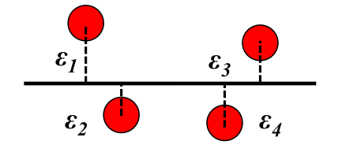</img></center>  

## Representação de um modelo linear simples

* Um modelo de regressão linear simples pode ser representado como:
<center>y = _$\beta$_~0~ + _$\beta$_~1~ _x_ + _$\epsilon$_</center>
    + $\beta$~0~ é o __intercepto__ do modelo - o valor de y quando x é 0;
    + $\beta$~1~ é a __inclinação__ ou __slope__ da regressão - a forma pela qual a magnitude de Y muda em função dos valores de x;
    + $\epsilon$ é o __erro__ na estimativa do valor de Y que não pode ser explicados pela variação nos valores de x.

## Representação de um modelo linear simples

<center>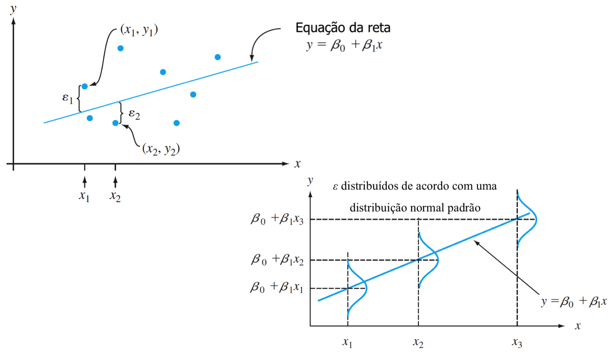</img></center>  

## A mecânica da regressão linear simples

* O princípio geral para determinar a equação da reta na regressão linear é minimizar a distância entre a localização da reta e cada combinação de valores de __x__ e __y__. 

<center>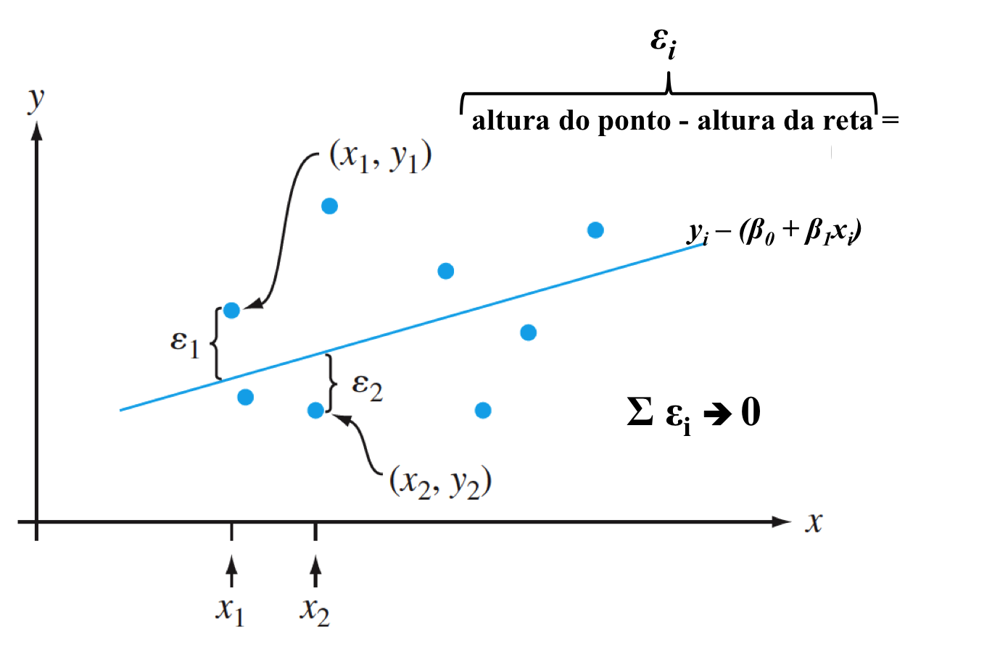</img></center>  

## A mecânica da regressão linear simples

* A inclinação da regressão, _$\beta$~1~_, é calculada como a razão entre a __covariância x e y__ pela __variância de x__.

$$\beta_1 = \frac{\sum(x_i - \bar{x})(y_i - \bar{y})}{\sum(x_i - \bar{x})^2} = \frac{cov(x,y)}{var(x)}$$

* Já o intercepto da regressão, _$\beta$~0~_, é calculada como a mudança no valor da média _y_ a partir da magnitude do efeito de _$\beta$~1~_ para o valor da média de _x_; em outras palavras, pela forma como o valor médio de x muda o valor médio de y.

$$\beta_0 = \frac{\sum{y_i} - \beta_1\sum{x_i}}{n} = \bar{y}-\beta_1\bar{x}$$

## A mecânica da regressão linear simples

* Uma vez que tenhamos os valores de _$\beta$~0~_ e _$\beta$~1~_, podemos calcular os __valores ajustados__ de y para cada valor de x.
* Estes valores ajustados são os novos valores de y~i~ preditos pelos valores de x de acordo com o modelo estabelecido, sendo representados por _$\hat{y_i}$_.  
* Com base nos desvios entre os valores observados, y~i~ e os valores preditos pelos modelo, _$\hat{y_i}$_, podemos calcular a __variação residual__ para cada observação, isto é $\epsilon_i$ = y~i~ - $\hat{y_i}$.  
* Se elevarmos estas diferenças ao quadrado e as somarmos, teremos calculado a __Soma dos Quadrados Residual__ da regressão:  

<center>SSE = $\sum$(y~i~ - $\hat{y_i}$)^2^</center>

## A mecânica da regressão linear simples

* De forma similar ao que aprendemos na ANOVA, também podemos calcular a variação total existente nos valores de _y_ - a __Soma dos Quadrados Totais__.  

<center>SST = $\sum$(y~i~ - $\bar{y}$)^2^ = _var_(y)</center>

* Note então que, com estas duas quantidade, já podemos realizar dos cálculos:
    + A variabilidade em y que pode ser explicada pelos valores de x, isto é a __Soma dos Quadrados da Regressão__ (SSR):
        + SST = SSR + SSE (lembre-se da analogia à ANOVA);  
    + O coeficiente de determinação da regressão, R^2^; e,  
    + Um valor de teste estatístico, baseado na distribuição de probabilidade F, que nos ajudará a determinar se a a variabilidade explicada pela regressão é maior do que aquela explicada pela variação residual nos dados.  

## A mecânica da regressão linear simples

* O coeficiente de determinação da regressão, R^2^, descreve o quanto da variabilidade total dos dados é explicada pela regressão.
* Calculado como:  
  
<center>R^2^= 1 - $\frac{SSE}{SST}$</center>  
  
* Já o teste estatístico deve considerar a Soma dos Quadrados da Regressão (SSR) e a Soma dos Quadrados Residual (SSE) bem como seus graus de liberdade para a determinação de seus respectivos Quadrados Médios (F = MSR/MSE):
    + Graus de liberdade para SSR = 1, já que estamos estimando apenas 1 parâmetro, o _$\beta$~1~_.
    + Graus de liberdade para SSE = n - 2, já que precisamos estimar dois parâmetros para a sua determinação, o _$\beta$~0~_ e o _$\beta$~1~_.

## Exemplo

* Qual a relação entre a área das ilhas e a sua riqueza de espécies? A função `lm` no R pode ser usada para ajudar uma regressão aos dados e responder essa pergunta.

```{r}
modelo <- lm(log(riqueza) ~ log(area), data = ilhas)
anova(modelo)
```

## Teste de hipóteses sobre os $\beta$s

* Tão importante quanto estimar a significância estatística da regressão, é quantificar $\beta$~0~ e $\beta$~1~, bem como a sua variabilidade.
* Podemos calcular a estimativa do erro, S, para o intercepto (_$\beta$~0~_) e para a inclinação da reta (_$\beta$~1~_) como:

$$S_{\beta_0~} = S_{\beta_1} ~~\sqrt{\frac{1}{n} ~ \sum_{i = 1}^n~x_i^2}$$

$$S_{\beta_1~} = \sqrt{\frac{MSE}{var(x)}}$$

## Teste de hipóteses sobre os $\beta$s

* Os $\beta$s seguem uma distribuição t de Student com _n - 2_ graus de liberdade, portanto podemos usar o valor de t como o teste estatístico para testar hipóteses sobre os valores de _$\beta$~0~_ e/ou _$\beta$~1~_.

$$t = \frac{\beta_i - \beta_{H_0}}{S_{\beta_i}}$$

* O método para se obter as estimativas dos _$\beta$_ na regressão linear é conhecido como __(Ordinary) Least Squares__, uma vez que ele encontra estas estimativas minimizando a Soma dos Quadrados dos Resíduos entre os valores preditos pelo modelo (_$\hat{y_i}$_) e os valores originais observados (_y~i~_).

## Exemplo {.smaller}

* No R, podemos ter acesso aos coeficientes (_$\beta$s_) e demais informações de interesse sobre o modelo através da função `summary`.

```{r}
summary(modelo)
```

## Exercício 1

* Em duplas, discutam e interpretem os resultados obtidos através do `summary(modelo)`.
* O que seria um modelo que contenha apenas o intercepto? O que ele representaria?
* Qual a notação de um modelo que contenha apenas o intercepto?

## Interações entre variáveis preditoras

* Na maioria das vezes, estamos interessados em determinar qual o efeito da magnitude de mais de uma variável preditora sobre a magnitude da variável resposta. Nesses casos, utilizar um modelo para cada variável resposta não faz sentido, hora porque não te permite testar diretamente a sua hipótese, hora porque pode aumentar a chance de erro do tipo I.
* Em tais casos, devemos criar modelos que contenham:
    + Os efeitos principais de todas as variáveis preditoras de interesse (__main effects__); e/ou,
    + Os efeitos principais de todas as variáveis preditoras e a __interação__ entre elas (__main effects__ e __interação__).

## Efeitos principais _vs_ interações

* O efeito principal de uma variável preditora (_main effect_) é aquele que descreve a forma pela qual esta variável modifica os valores da variável resposta, considerando o efeito de outras variáveis preditoras.

<center>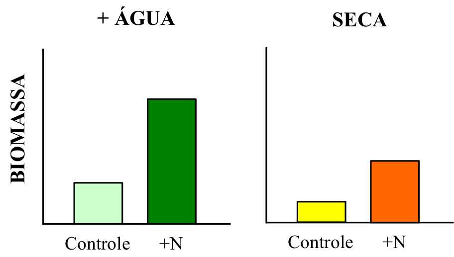</img></center>

## Efeitos principais _vs_ interações

* Cada fator tem um efeito principal e individual na variável resposta: adição de nutrientes é aumentar a biomassa, enquanto que o efeito principal da seca é reduzir a biomassa.

<center>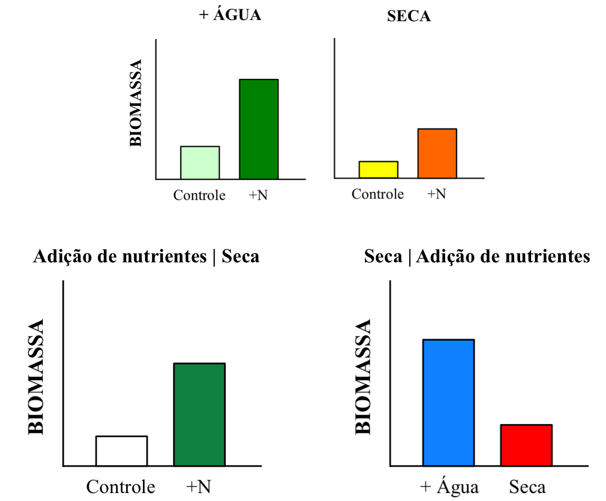</img></center>

## Efeitos principais _vs_ interações

* Uma interação descreve a forma pela qual o efeito principal de uma variável preditora modifica o efeito principal de outra variável preditora sobre a variável resposta.

<center>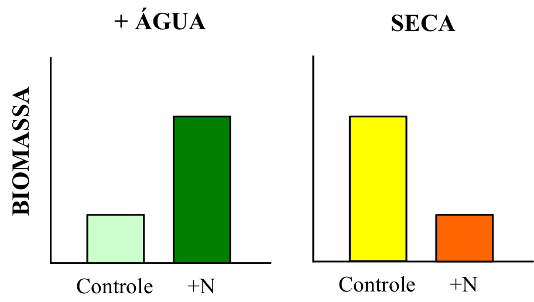</img></center>

## Efeitos principais _vs_ interações

* Não podemos tirar conclusões sobre os efeitos principais de duas ou mais variáveis preditoras quando existe uma interação entre elas.
* Antagonismos e sinergismos nos efeitos variáveis preditoras são interações.

<center>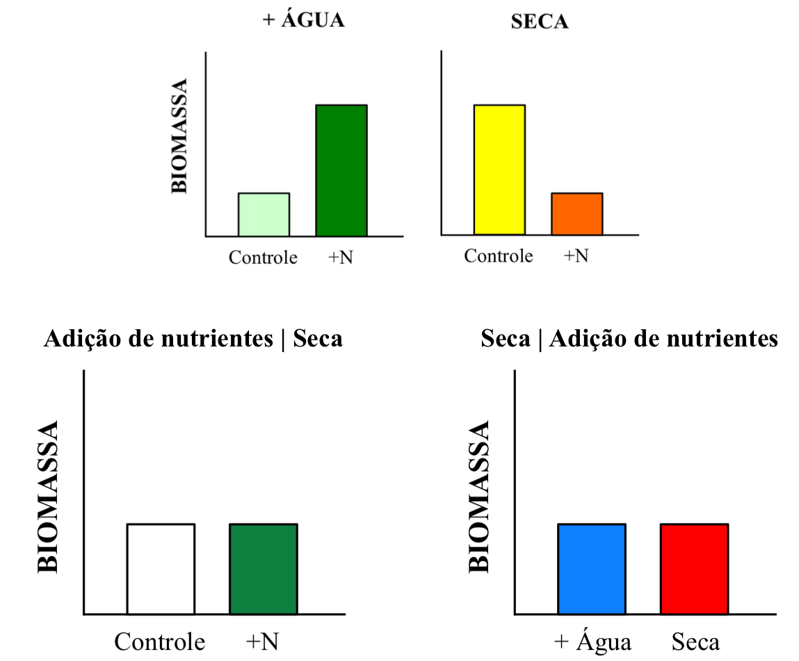</img></center>

## Interações entre variáveis categóricas

<center>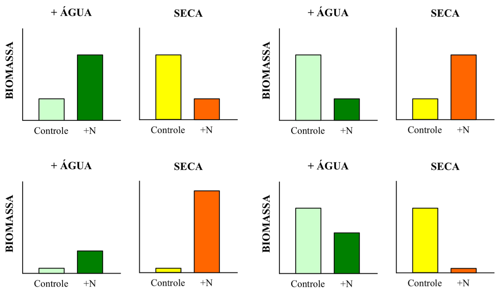</img></center>

## Interações entre uma variáveis categóricas e contínuas

<center>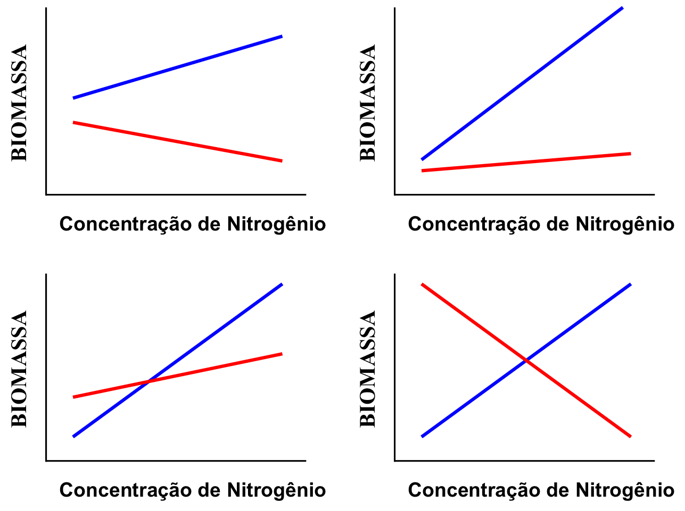</img></center>

## Interações entre variáveis contínuas

<center></img></center>

## Interações: como detectar e considerar?

* Podemos __detectar__ a presença de uma interação:
    + Através da análise exploratória dos dados - figuras, figuras, figuras...
    + Adicionando uma interação ao modelo e testando:
        + Sua significância; e/ou,
        + Se sua inclusão melhora o ajuste do modelo aos dados.  

* Devemos __considerar__ uma interação no modelo quando:
    + Sua inclusão melhora o ajuste do modelo aos dados;  
    + A sua pergunta/hipótese/predição incorpora envolve a existência de uma interação;  
    + O seu experimento/delineamento contém uma interação.  
    
## Notação de modelos com múltiplas preditoras

* Vimos que um modelo de regressão linear simples pode ser escrito na forma:

<center>y = _$\beta$_~0~ + _$\beta$_~1~ _x_ + _$\epsilon$_</center>

* Neste mesmo sentido, podemos descrever o modelo que contenha múltiplas variáveis preditoras _x~i~_ na forma:

<center>y = _$\beta$_~0~ + _$\beta$_~1~ _x~1~_ + _$\beta$_~2~ _x~2~_ + ... + _$\beta$_~i~ _x~i~_ + _$\epsilon$_</center>  
  
* Quando temos variáveis categóricas em um modelo, calculamos n - 1 valores de _$\beta$_~i~ (onde i $\not=$ 0).

* Isto ocorre pois o intercepto _$\beta$_~0~ é tomado como um dos níveis da variável categórica e os outros _$\beta$_~i~ representaram o quanto os outros níveis alteram a estimativa de _$\beta$_~0~.

## Notação de modelos com múltiplas preditoras

* No exemplo abaixo, temos uma variável preditora categórica, com três níveis: a, b e c.  

```{r echo=FALSE}
data.frame(preditor = rep(c("a", "b", "c"), times = 3), resposta = round(runif(n = 9, min = 1, max = 10), digits = 1))
```

## Notação de modelos com múltiplas preditoras {.smaller}

* Quando criamos um modelo utilizando esta variável preditora, convertemos cada nível dela que não será o intercepto para valores de 0 ou 1 - isto é, ou a observação pertence aquele nível da variável preditora categórica ou não.

```{r echo=FALSE}
model.matrix(~ preditor, data = data.frame(preditor = rep(c("a", "b", "c"), times = 3), resposta = round(runif(n = 9, min = 1, max = 10), digits = 1)))
```

* Nesse exemplo, nosso modelo seria, onde "ligaríamos"" (_x~i~_ = 1) ou "desligaríamos" (_x~i~_ = 0) os valores de _x_ de acordo com o nível do fator:

<center>y = _$\beta$_~0~ + _$\beta$_~b~ _x~b~_ + _$\beta$_~c~ _x~c~_ + _$\epsilon$_</center>  

## Notação de modelos com múltiplas preditoras

* Finalmente, quando temos uma interação em um modelo, calculamos um _$\beta$_~i~ para os efeitos principais de cada variável preditora, além de um outro _$\beta$_~i~ para a interação entre as variáveis preditoras:

<center>y = _$\beta$_~0~ + _$\beta$_~1~ _x~1~_ + _$\beta$_~2~ _x~2~_ + _$\beta$_~3~ _x~1~_ _x~2~_ + _$\epsilon$_</center>  

* Para termos uma interação em um modelo, precisamos considerar os seus efeitos principais também. Em outras palavras: __não pode existir um modelo somente com a interação sem haver também os efeitos principais__.  

<center>y = _$\beta$_~0~ + _$\beta$_~3~ _x~1~_ _x~2~_ + _$\epsilon$_</center> 
<center>(não existe)</center> 

## Regressão Múltipla  

* É similar à regressão linear simples, mas incorpora os efeitos principais e, eventualmente, as interações entre múltiplas variáveis preditoras contínuas sobre a magnitude de uma variável resposta.  
* Possui os mesmos pressupostos da regressão linear simples, com a adição de que as variáveis preditoras __não__ podem ser __colineares__.
    + Colinearidade: implica em uma alta correlação entre duas variáveis preditoras que, normalmente, representam o mesmo fenômeno ou fenômenos muito similares. Por exemplo:
        + Concentração de O~2~ na água _vs_ saturação de O~2~ na água;
        + Tamanho do corpo _vs_ biomassa;
        + Temperatura máxima _vs_ mínima _vs_ amplitude; ...
* Um modelo de regressão múltipla é:
<center>y = _$\beta$_~0~ + _$\beta$_~1~ _x~1~_ + _$\beta$_~2~ _x~2~_ + ... + _$\beta$_~i~ _x~i~_ + _$\epsilon$_</center>  

## Como calcular os $\beta$s na regressão múltipla

* A matemática pode ser complicada (método #1)...

$$\beta_1 = \frac{(\sum_{i = 1}^n~{x^2_{2i}}) (\sum_{i = 1}^n~x_{1i}y_{i}) - (\sum_{i = 1}^n~x_{1i}x_{2i}) (\sum_{i = 1}^n~x_{2i}y_{i})}{(\sum_{i = 1}^n~{x^2_{1i}})(\sum_{i = 1}^n~{x^2_{2i}}) - (\sum_{i = 1}^n~{x_{1i}{x_{2i}}})^2}$$

$$\beta_2 = \frac{(\sum_{i = 1}^n~{x^2_{1i}}) (\sum_{i = 1}^n~x_{2i}y_{i}) - (\sum_{i = 1}^n~x_{1i}x_{2i}) (\sum_{i = 1}^n~x_{1i}y_{i})}{(\sum_{i = 1}^n~{x^2_{1i}})(\sum_{i = 1}^n~{x^2_{2i}}) - (\sum_{i = 1}^n~{x_{1i}{x_{2i}}})^2}$$

* Quanto mais _$\beta$_s, maior o número de termos no numerador e denominador para considerar o efeito de outras variáveis.

## Como calcular os $\beta$s na regressão múltipla

* ...ou mais simples (método #2).  
* Calcular o coeficiente de correlação entre cada variável preditora _x~n~_ e a variável resposta _y_:

$$r_{ny} = \frac{\sum(x_{ni} - \bar{x_n})(y_i - \bar{y})}{\sqrt{\sum(x_{ni} - \bar{x_n})^2 - \sum(y_i - \bar{y})^2}}$$
 
* Calcular o coeficiente de correlação entre cada variável preditora no modelo:
    
$$r_{n_j~n_k,~k\not=j} = \frac{\sum(x_{nj,i} - \bar{x_{nj}})(x_{nk,i} - \bar{x_{nk}})}{\sqrt{\sum(x_{nj,i} - \bar{x_{nj}})^2 - \sum(x_{nk,i} - \bar{x_{nk}})^2}}$$   

## Como calcular os $\beta$s na regressão múltipla

* Através do método #2, o _$\beta$_ do efeito da variável preditora 1 na variável resposta é, então:

$$\beta'_{1y,2} = \frac{r_{1y} - r_{2y}~r_{12}}{(1 - r^2_{12})}$$

* Enquanto que o _$\beta$_ do efeito da variável preditora 2 na variável resposta é:

$$\beta'_{2y,1} = \frac{r_{2y} - r_{1y}~r_{12}}{(1 - r^2_{12})}$$

## Diferença entre o método #1 e #2

* Através do método #1 obtemos uma estimativa do quanto a __mudança em uma unidade__ na variável preditora #1 altera a magnitude da variável resposta, controlando o efeito da variável preditora 2 ($\beta$~1~ e $\beta$~2~).
* Já, através do método #2, obtemos uma estimativa do quanto a __mudança em uma unidade de desvio padrão__ na variável preditora #1 __altera em um desvio padrão__ a magnitude da variável resposta, controlando o efeito da variável preditora 2 ($\beta'$~1~ e $\beta'$~2~).
* Podemos converter entre as duas formas através da fórmula:

$$\beta_{jy,k} = \beta'_{jy,k}~\frac{S_y}{S_{xj}}$$

## Exemplo {.smaller}

* O R considera o método #1:

```{r}
modelo1 <- lm(log(riqueza) ~ log(area) + precipitacao, data = ilhas) 
summary(modelo1)
```

## Exemplo {.smaller}

* Mas podemos calcular o $\beta'$ a partir do modelo:  

```{r}
## coeficientes do modelo
round(coef(modelo1), digits = 5)

## mudando a igualdade
(coef(modelo1)[2] * sd(log(ilhas$area)))/sd(log(ilhas$riqueza))
(coef(modelo1)[3] * sd(ilhas$precipitacao))/sd(log(ilhas$riqueza))
```

## Exemplo {.smaller}

* Ou padronizar e centralizar as variáveis preditoras e resposta __antes__ de rodar o modelo (padronizar = transformação em valores de _Z_).
* Existem várias opções para automatizar esse processo, _e.g._ através da função `standardize` do pacote `arm`.

```{r eval=FALSE}
library(arm)
standardize(lm(log_riqueza ~ log_area + precipitacao, data = ilhas), standardize.y = TRUE)
```

```{r echo=FALSE}
ilhas$log_riqueza <- log(ilhas$riqueza)
ilhas$log_area <- log(ilhas$area)
round(coef(arm::standardize(lm(log_riqueza ~ log_area + precipitacao, data = ilhas), standardize.y = TRUE)), digits = 5)
```

## Estimando a importância de uma variável na regressão {.smaller}

* $\beta'$ é conhecido como o __coeficiente padronizado__ e é uma estimativa não-enviesada da magnitude do efeito de uma variável preditora na variável resposta.
    + Coeficientes não são afetados pela sua magnitude: importante quando variáveis preditoras variam em ordens de grandeza.

```{r echo=FALSE}
t(data.frame(area = range(ilhas$log_area), precipitacao = range(ilhas$precipitacao), row.names = c("min", "max")))
round(coef(lm(log_riqueza ~ log_area + precipitacao, data = ilhas)), digits = 5)
round(coef(arm::standardize(lm(log_riqueza ~ log_area + precipitacao, data = ilhas), standardize.y = TRUE)), digits = 5)
```
  
## Estimando a importância de uma variável na regressão {.smaller}

* $\beta'$ é conhecido como o __coeficiente padronizado__ e é uma estimativa não-enviesada da magnitude do efeito de uma variável preditora na variável resposta.
    + Coeficientes das variáveis preditoras polinomiais e/ou que representem algum tipo de não-linearidade podem ser expressas de forma mais 'natural'.

```{r echo=FALSE}
round(coef(lm(log_riqueza ~ log_area + precipitacao + I(precipitacao^2), data = ilhas)), digits = 7)
round(coef(arm::standardize(lm(log_riqueza ~ log_area + precipitacao + I(precipitacao^2), data = ilhas), standardize.y = TRUE)), digits = 5)
```

## Estimando a importância de uma variável na regressão {.smaller}

* $\beta'$ é conhecido como o __coeficiente padronizado__ e é uma estimativa não-enviesada da magnitude do efeito de uma variável preditora na variável resposta.
    + A expressão do coeficiente da interação não afeta a expressão dos coeficientes dos efeitos principais.
    
```{r eval=FALSE}
## uma forma de representar a interacao
modelo2 <- lm(log_riqueza ~ log_area * precipitacao, data = ilhas)
## outra forma de representar a interacao
modelo2 <- lm(log_riqueza ~ log_area + precipitacao + log_area : precipitacao, data = ilhas)
```

```{r echo=FALSE}
round(coef(lm(log_riqueza ~ log_area * precipitacao, data = ilhas)), digits = 7)
round(coef(arm::standardize(lm(log_riqueza ~ log_area * precipitacao, data = ilhas), standardize.y = TRUE)), digits = 5)
```

## Regressão: miscelânias e resumindo {.smaller}

1. Padronize as variáveis preditoras e resposta se você quiser ter uma noção da importância de cada variável em um modelo;
2. Padronização será especialmente importante quando houver interações, termos não-lineares e durante a seleção de modelos!;
3. Faça interpretações sobre a mudança na magnitude da variável y em função das variáveis preditoras usando os valores em escala natural;
4. Interações entre variáveis preditoras podem ser representadas como "variavel #1 * variavel #2" ou "variavel #1 + variavel #2 + variavel #1 : variavel #2";  
5. Graus de liberdade de cada variável preditora contínua é sempre n - 1; para os resíduos será n - k - 1, onde k é o número de variáveis preditoras contínuas no modelo;
6. Existe uma diferença entre na forma como o teste estatístico é feito e testado no `summary` e na `anova`, vamos ver isso mais a frente;
7. Atente ao R^2^ ajustado da regressão: leva em consideração o número de variáveis preditoras no modelo para estimar o coeficiente de determinação.  

## ANOVA n-way

* É a análise de variância utilizada quando estamos interessados em determinar o efeito de duas ou mais variáveis preditoras categóricas (_x~1~_, _x~2~_,..., _x~n~_) sobre a magnitude de uma variável resposta contínua (_y) - portanto, possui todos os pressupostos da ANOVA one-way.
* Testa a hipótese nula de que os valores das médias entre os níveis de cada uma das variáveis categóricas não diferem entre si:

$$H_{0,A} = \mu_{A1} + \mu_{A2} + ... + \mu_{An} = 0~~~OU ~~~ \mu_{A1} = \mu_{A2} = ... = \mu_{An}$$

$$H_{0,B} = \mu_{B1} + \mu_{B2} + ... + \mu_{Bn} = 0~~~OU ~~~ \mu_{B1} = \mu_{B2} = ... = \mu_{Bn}$$

* No exemplo acima, temos dois fatores sendo testados simultaneamente na ANOVA; neste caso, chamamos este teste de __ANOVA two-way__ ou __ANOVA de dois fatores__.
    + ANOVA three-way, ANOVA four-way, ANOVA five-way,..., ANOVA n-way.

## ANOVA n-way

* Uma ANOVA n-way pode ser utilizada para testar apenas os efeitos principais de dois fatores _ou_ os seus efeitos principais e interações.
    + ANOVA two-way: _y_ = _$\beta$~0~_ + _$\beta$~A~ x~A~_ + _$\beta$~B~ x~B~_ + _$\epsilon$_
    + ANOVA two-way fatorial: _y_ = _$\beta$~0~_ + _$\beta$~A~ x~A~_ + _$\beta$~B~ x~B~_ + _$\beta$~AB~ x~A~ x~B~_ + _$\epsilon$_
* Nem toda ANOVA n-way precisa ser uma ANOVA fatorial! As vezes, características da pergunta, hipóteses, predições, da amostragem e dos próprios dados previnem com que utilizemos uma combinação fatorial e tenhamos as interações no modelo.

```{r echo=FALSE}
table(data.frame("cor_da_flor" = rep(c("verde", "azul", "amarela"), each = 4), 
                 "presenca_de_odor" = c(rep(c("sim", "sim", "nao", "nao"), 2), rep("sim", 4))))
```

## A mecânica de uma ANOVA n-way

<center>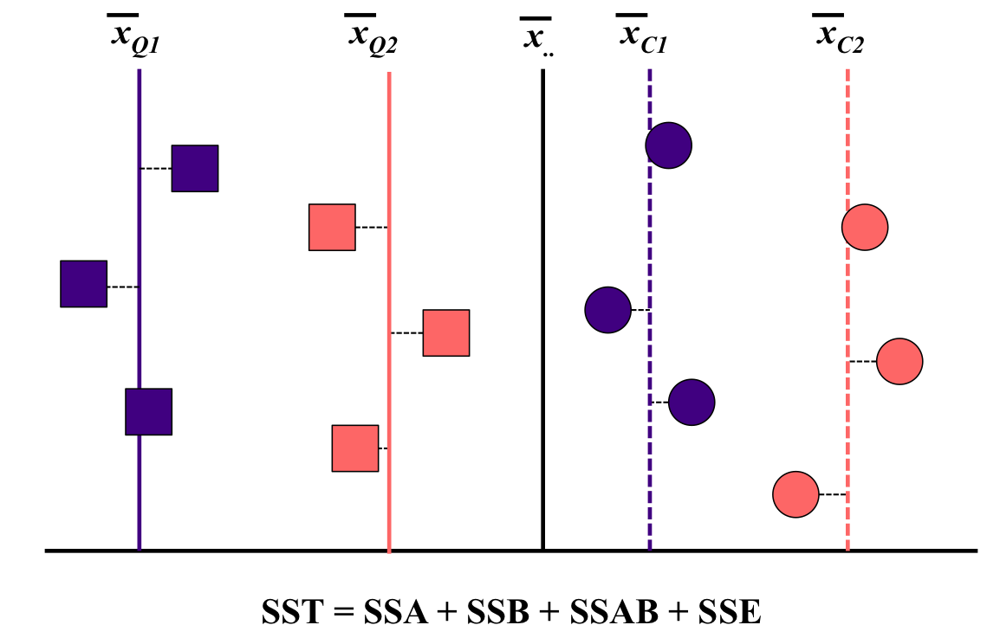</img></center>

## A mecânica de uma ANOVA n-way

<center>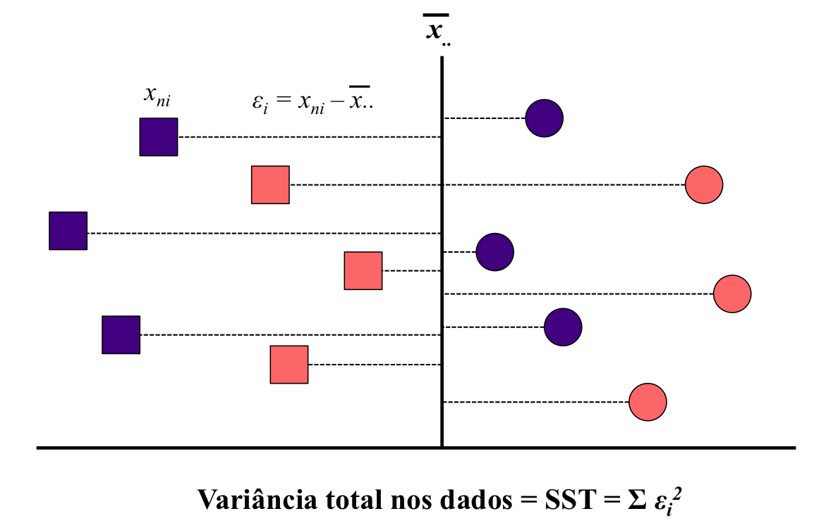</img></center>

## A mecânica de uma ANOVA n-way

$$SSA_Q = (\bar{x_{Q.}} -\bar{x}_{..})^2~~~~~~~~~~~~~~SSA_C = (\bar{x_{C.}} -\bar{x}_{..})^2$$

<center>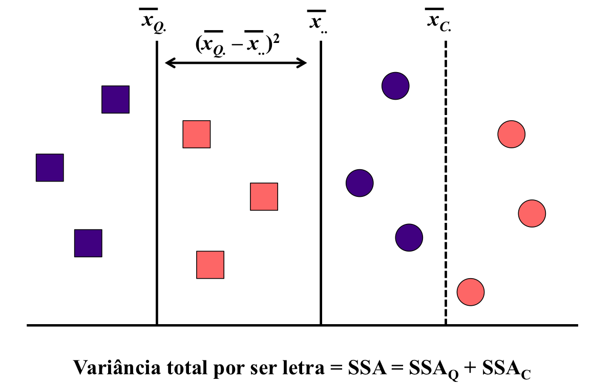</img></center>

## A mecânica de uma ANOVA n-way

$$SSB_1 = (\bar{x_{.1}} -\bar{x}_{..})^2~~~~~~~~~~~~~~SSB_2 = (\bar{x_{.2}} -\bar{x}_{..})^2$$

<center>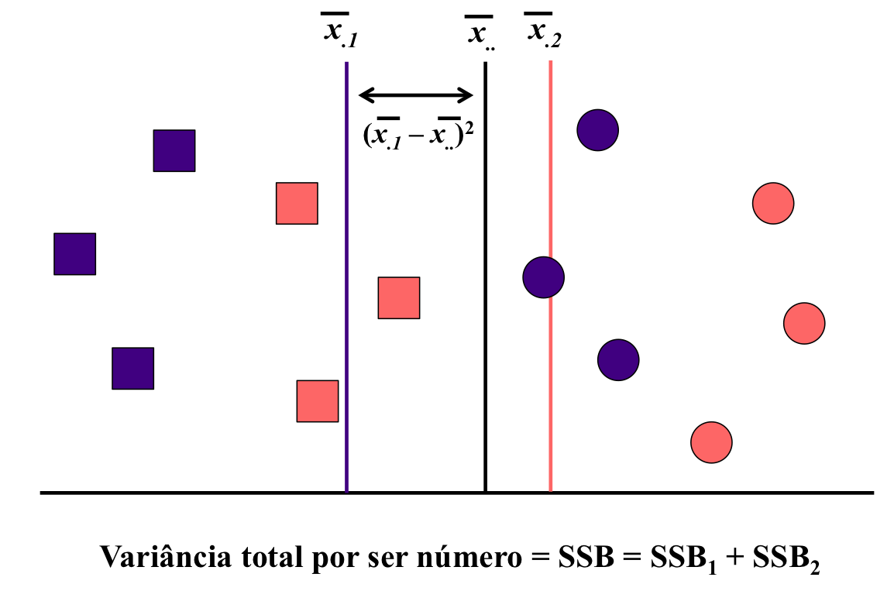</img></center>

## A mecânica de uma ANOVA n-way

$$SSAB = \sum_{i}\sum_{j}~(\bar{x_{ij}} - \bar{x_{i.}} - \bar{x_{.j}} + \bar{x_{..}})^2$$

<center>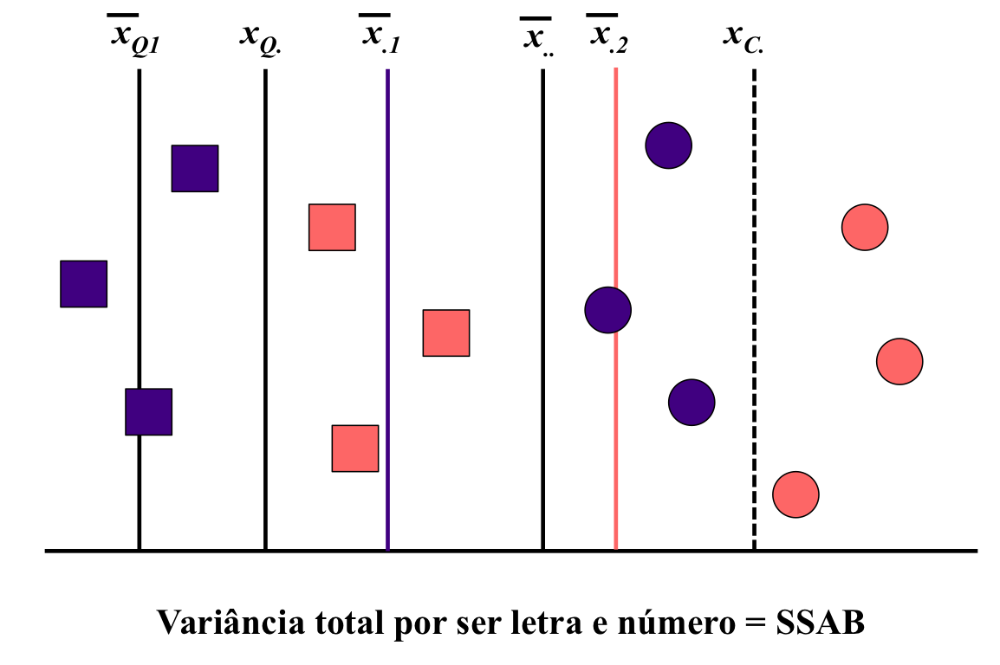</img></center>

## Teste estatístico para a ANOVA n-way

* Assim como fizemos para a ANOVA one-way, a ANOVA n-way utiliza como teste estatístico os valores de F para cada termo utilizado.  
* Os valores de F são obtidos pela razão entre a Média dos Quadrados de cada termo e a Média dos Quadrados do Resíduo: F = $\frac{MSX}{MSE}$
* Os graus de liberdade para o cálculo de cada Média dos Quadrados é:
    + A - 1 ou B -1 para cada efeito principal, , onde A e B representam o número de níveis dentro de cada fator analisado;
    + (A - 1)(B - 1) para a interação; 
    + AB(n - 1) para a variação residual, onde n é o número total de observações; e,
    + AB - 1 para a variação total.

## Exemplo

* No R, podemos fazer uma ANOVA two-way associando a função `lm` à `anova`:

```{r}
modelo3 <- lm(log(riqueza) ~ ilha * montanha, data = ilhas)
anova(modelo3)
```

## Exercício 2

* Em duplas, comparem os resultados abaixo. O que você notou de diferente entre eles?
* Por que vocês acham que isso ocorreu?

```{r eval=FALSE}
anova(lm(log(riqueza) ~ ilha * montanha, data = ilhas))
anova(lm(log(riqueza) ~ montanha * ilha, data = ilhas))
```

## Tipo de Soma dos Quadrados

* Apesar de intuitivo e fácil a obtenção dos valores de F para o teste estatístico, a maioria dos pacotes estatísticos oferece três formas principais para o cálculo das somas dos quadrados e valores de F.
    + Soma dos Quadrados do Tipo I ou __Soma dos Quadrados Sequencial__.
    + Soma dos Quadrados do Tipo II ou __Soma dos Quadrados Marginal__.
    + Soma dos Quadrados do Tipo III.
* A escolha do tipo de Soma dos Quadrados depende das suas perguntas, hipóteses e/ou predições.  
* Mais sobre isso em: 
    + https://mcfromnz.wordpress.com/2011/03/02/anova-type-iiiiii-ss-explained/
    + https://www.uvm.edu/~dhowell/StatPages/More_Stuff/Type1-3.pdf

## Soma dos Quadrados Sequencial (Tipo I)

* Útil quando sua hipótese preve que um efeito só aparece depois de controlarmos a influência de alguma outra variável.

<center>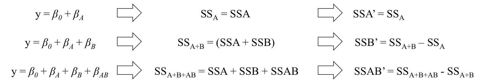</img></center>

## Soma dos Quadrados Marginal (Tipo II)

* Útil quando sua hipótese preve quer testar os efeitos de cada variável isolando o efeito das demais.

<center>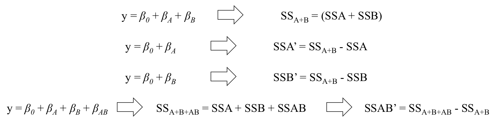</img></center>

## Soma dos Quadrados do Tipo III

* Útil quando sua hipótese preve quer testar os efeitos de uma interação.

<center>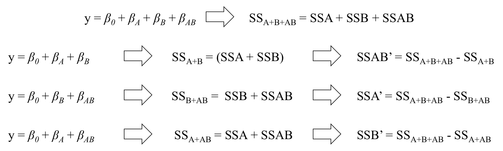</img></center>

## Soma dos Quadrados no R {.smaller}

* No R, podemos utilizar a função `Anova` do pacote `car` para rodar ANOVAs com Soma dos Quadrados do Tipo II e III.

```{r}
Anova(modelo3, type = 2)
```

## Soma dos Quadrados no R {.smaller}

* No R, podemos utilizar a função `Anova` do pacote `car` para rodar ANOVAs com Soma dos Quadrados do Tipo II e III.

```{r}
Anova(modelo3, type = 3)
```

## Análise de Covariância (ANCOVA) e similares {.smaller}

* Podemos combinar os efeitos principais e interações entre variáveis preditoras categóricas e contínuas em um mesmo modelo.
* Uma aplicação útil destes modelos é incorporar e controlar o efeito de uma covariável sobre a variável resposta, ao tentar estimar o efeito de um tratamento.
    + Variação natural no tamanho do habitat ou entre unidades amostrais, ao relacionar diversidade de habitats à riqueza de espécies;
    + Controlar a variação da biomassa dos indivíduos ao medir o efeito da temperatura no metabolismo;
    + Considerar o efeito da variação na concentração de nutrientes entre unidades amostrais ao examinar o efeito de uma outra variável no efeito das espécies;...

<center>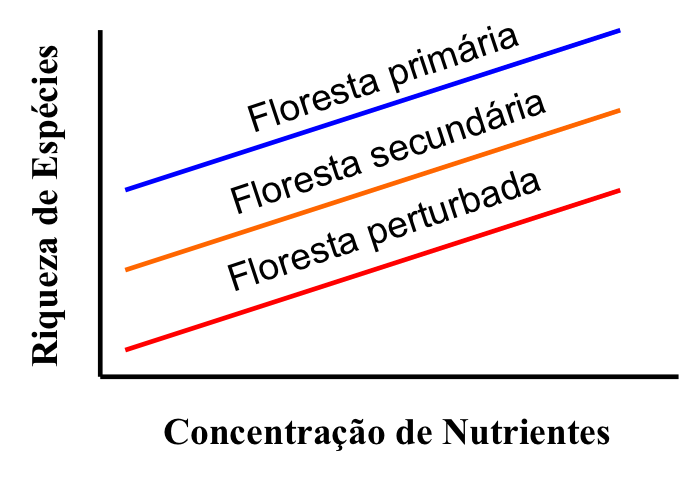</img></center>

## Análise de Covariância (ANCOVA) e similares

* Existem três hipóteses que normalmente testamos com desenhos do tipo "ANCOVA":

<center>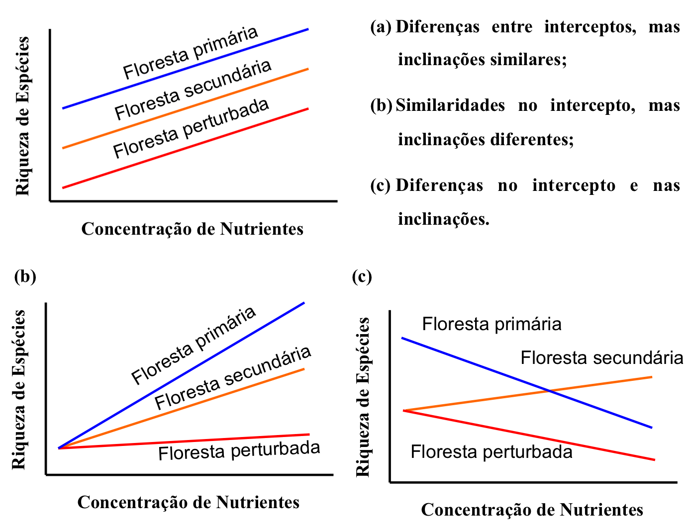</img></center>

## Análise de Covariância (ANCOVA) e similares

* A ANCOVA é o caso especial no qual apenas os interceptos variam, mas as inclinações das restas entre os níveis da variável categórica preditora são similares;
* Na ANCOVA, a estimativa dos $\beta$s para cada nível da variável preditora são feitas para um valor fixo da variável preditora contínua _x_.
* No R:

```{r eval=FALSE}
## usado apenas para ANCOVA stricto sensu
modelo4 <- lm(log(riqueza) ~ log(area) + ilha, data = ilhas)
## usado para ANCOVA (quando a interação não é significativa) e similares
modelo4 <- lm(log(riqueza) ~ log(area) * ilha, data = ilhas)
```

## Exemplo {.smaller}

```{r}
modelo4 <- lm(log(riqueza) ~ log(area) * ilha, data = ilhas)
summary(modelo4)
```

## Pós-testes {.smaller}

* Assim como para a ANCOVA, podemos realizar pós-testes para a ANOVA n-way e ANCOVA (e similares) utilizando o pacote `lsmeans`.

```{r}
lsmeans(object = modelo3, specs = ~ ilha + montanha)
```

## Pós-testes {.smaller}

* Assim como para a ANCOVA, podemos realizar pós-testes para a ANOVA n-way e ANCOVA (e similares) utilizando o pacote `lsmeans`.

```{r}
contrast(lsmeans(object = modelo3, specs = ~ ilha + montanha), 
         by = "montanha", method = "tukey", adjust = "none")
```

## Pós-testes {.smaller}

* Assim como para a ANCOVA, podemos realizar pós-testes para a ANOVA n-way e ANCOVA (e similares) utilizando o pacote `lsmeans`.

```{r}
lstrends(model = modelo4, specs = "ilha", var = "log(area)")
```

## Pós-testes {.smaller}

* Assim como para a ANCOVA, podemos realizar pós-testes para a ANOVA n-way e ANCOVA (e similares) utilizando o pacote `lsmeans`.

```{r}
contrast(lstrends(model = modelo4, specs = "ilha", var = "log(area)"), method = "tukey")
```
