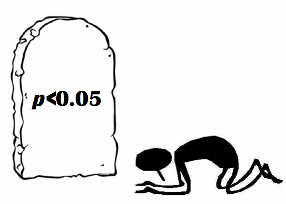

## Testes de Significância  

* Na nossa cabeça, é a etapa principal da análise de dados.  
* Deve ser a última etapa do processo de estabelecimento do modelo final, apesar de sempre pensarmos em ser a primeira delas.  

<center></img></center>  

## O valor de p | A ditadura dos testes de significância  

* __Valores de p__ não devem ser usados como medida de tamanho do efeito;  
* Recentemente, a Associação Americana de Estatística (ASA) recomendou um banimento do uso dos valores de p:

> "Researchers should recognize that a p-value without context or other evidence provides limited information."  

<center></img></center>  

## O que são os valores de p?  

<center></img></center>  

## O que são os valores de p?  

* Reproduza este código no seu console.  

```{r eval=FALSE}
gerador <- function(numero, tamanho, media, desvio, valor, lower = FALSE){
  set.seed(numero)
  distribuicao <- rnorm(n = tamanho, mean = media, sd = desvio)
  quantis <- as.vector(quantile(distribuicao, probs = c(0.025, 0.975)))
  probabilidade <- pnorm(q = valor, mean = mean(distribuicao), sd = sd(distribuicao), lower.tail = lower)
  
  hist(distribuicao, main = (""), xlab ="", ylab = "")
  
  mtext(text = paste("2.5 % = ", round(quantis[1],2)), side = 3, adj = 0)
  mtext(text = paste("97.5 % = ", round(quantis[2], 2)), side = 3, adj = 1)
  mtext(text = paste("p = ", round(probabilidade, 2)), side = 3, adj = 0.5)
  mtext(text = paste("valor = ", valor), side = 1, adj = 0.5)
  
  lines(x = c(mean(distribuicao), mean(distribuicao)), y = c(0, 150), lty = 1, lwd = 3)
  lines(x = c(round(quantis[1],2), round(quantis[1],2)), y = c(0, 150), lty = 2, lwd = 3)
  lines(x = c(round(quantis[2],2), round(quantis[2],2)), y = c(0, 150), lty = 2, lwd = 3)
  lines(x = c(valor, valor), y = c(0, 150), lty = 1, lwd = 4, col = "red")
}
```

## O que são os valores de p?  

* Rode estas linhas de comando.  

```{r eval=FALSE}
library(manipulate)
manipulate(gerador(57, tamanho, media, desvio, valor), 
           tamanho = slider(10, 1000, step = 50),
           media = slider(0, 10, step = 0.5), 
           desvio = slider(1, 6, step = 0.5),
           valor = slider(-10, 10, step = 0.1))
```

## O que são os valores de p?  

* O valor de p é a probabilidade do valor testado ser próximo daquele esperado.  
* Os valores de p são sensíveis:  
    + À diferença entre o valor testado e o valor esperado: **tudo o mais sendo similar, quanto maior a diferença entre eles, mais fácil achar um valor significativo**.  
    + Ao tamanho da amostra: **tudo o mais sendo similar, quanto maior o tamanho da amostra, mais fácil é encontrar um resultado significativo**.  
    + À variância da amostra: **tudo o mais sendo similar, quanto maior a precisão da amostra, mais fácil é encontrar um resultado significativo**.    
    

## Significância dos Termos  

* Vamos carregar os dados e recriar o modelo final.  

```{r}
ilhas <- read.table(file = "../model_selection/dados/ilhas.txt", header = TRUE)
modelo1 <- glm(log10(riqueza) ~ log10(area) + ilha + arquipelago, data = ilhas)
modelo1$coefficients
```

## Significância dos Termos  

* A função `anova` pode ser usada para testar a significância dos termos no modelo.  
* Para o `glm` você precisa especificar o tipo de distribuição que será empregada para o teste dos termos.  

```{r}
anova(modelo1, test = "F")
```

## Significância dos Termos  

* Mas vamos reordenar os termos no modelo e repetir a  `anova`. O que ocorre?

```{r}
modelo2 <- glm(log10(riqueza) ~ ilha + arquipelago + log10(area), data = ilhas)
anova(modelo2, test = "F")
```


## Significância dos Termos | Soma dos Quadrados

* A ordem dos termos no modelo testado afeta a estimativa de sua significância.  
* Por padrão, o R utiliza a soma dos quadrados do tipo 1 na função `anova`.  
* Soma dos Quadrados:  

> - **Tipo 1 - Teste Sequencial**: a significância de cada termo é testado após considerar o efeito cumulativo do(s) termo(s) anteriore(s).  
  
> - **Tipo 2 - Teste Marginal**: a significância de cada termo é testado após considerar o efeito principal do(s) outro(s) termos(s).  
  
> - **Tipo 3 - Teste de Interação**: a significância de cada termo é testado após considerar o efeito principal do(s) outro(s) termo(s) e da(s) interação(ões) no modelo.  

## Significância dos Termos | Soma dos Quadrados  

* O tipo de Soma dos Quadrados utilizado deve ser baseado:  
    + Na hipótese que você quer testar (baseado no seu trabalho);  
    + Na estrutura do seu modelo:  
        - se você não possuir interações no modelo - Tipo 1 ou Tipo 2  
        - se você possuir interações no modelo - Tipo 3  
* Quando o termo de interação no modelo não é significativo (testado pela Soma dos Quadrados do Tipo 3), recomenda-se usar a Soma dos Quadrados do Tipo 2 (mais robusto).  

## Significância dos Termos | Soma dos Quadrados

* No R, a função `car::Anova` implementa o cálculo da Soma dos Quadrados do Tipo 2 e do Tipo 3.  
* Pode ser usado tanto com o `stats::glm` quanto com as funções dos pacotes `nlme` e `lme4` (para este último caso, existe uma opção melhor, impletementada com o pacote `lmerTest`).  

```{r warning=FALSE, message=FALSE}
library(car)
Anova(modelo1, type = "II", test.statistic = "F")
```

## Significância dos Termos | Soma dos Quadrados

* Um exemplo com interação.  

```{r}
modelo3 <- glm(log10(riqueza) ~ log10(area) * ilha * arquipelago, data = ilhas)
Anova(modelo3, type = "III", test.statistic = "F")
```

## Significância dos Termos | Soma dos Quadrados

* Nosso melhor modelo - o modelo final - é aquele que incorpora uma interação entre a área e o tipo da ilha, além de um termo com o tamanho do arquipélago.  

```{r}
modelo4 <- glm(log10(riqueza) ~  log10(area) * ilha + arquipelago, data = ilhas)
Anova(modelo4, type = "III", test.statistic = "F")
```

## Significância dos Termos | Overdispersion

* Fique atento à __overdispersion__ no `glm` com distribuição de Poisson e Binomial. 
  
* Por conta da sub-estimativa dos valores de erro dos parâmetros no modelo, você pode observar valores altamente significativos na tabela da ANOVA - mas totalmente errados.  

## Considerações finais  

* O teste de significância é uma parte do processo de análise de dados - idealmente, a última.  
  
* Não baseie suas conclusões apenas nos valores de p - use outras métricas também.  

* Tome cuidado ao analisar a significância de GLMs com distribuição de Poisson ou Binomial - __overdispersion__ pode minar seus resultados estatísticos.  